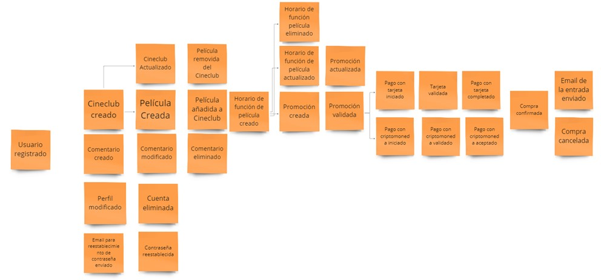

# Capítulo IV:  Strategic-Level Software Design

## 4.1 Strategic-Level Domain-Driven Design

### 4.1.1 Design Purpose

El propósito de diseño fundamental de nuestra aplicación web se centra en abordar la problemática identificada de la falta de acceso fácil y eficaz a películas no comerciales que se proyectan en cineclubes para los cinéfilos apasionados. Reconocemos que existe una audiencia ávida de cine independiente, clásico y cultural que no está siendo completamente atendida por las plataformas convencionales de streaming y exhibición. Nuestra solución está diseñada específicamente para satisfacer las necesidades de este segmento objetivo al proporcionar un medio intuitivo y eficaz para descubrir y acceder a estas películas fuera de lo común.

Al enfocarnos en conectar a los amantes del cine con experiencias cinematográficas únicas y fuera de lo común, estamos directamente abordando la problemática identificada. Reconocemos que estos cinéfilos tienen intereses y gustos que van más allá de las películas comerciales de Hollywood y desean explorar una amplia gama de opciones independientes y culturales.

Además, nuestra solución se orienta a satisfacer las necesidades del negocio al fomentar la comunidad cinéfila. Al proporcionar una plataforma donde los usuarios pueden compartir recomendaciones, críticas y detalles sobre proyecciones en cineclubes locales, estamos creando un espacio donde los cinéfilos pueden interactuar, participar activamente y contribuir al crecimiento de la comunidad. Esto no solo mejora la experiencia del usuario, sino que también aumenta la participación y la retención, lo que a su vez beneficia a nuestro negocio al consolidar nuestra posición como el destino principal para los amantes del cine independiente y cultural.

### 4.1.2 Attribute-Driven Design Inputs

#### 4.1.2.1 Primary Funcionality (Primary User Stories)

| Epic / User Story ID | Título                                 | Descripción                                                                                                                                                                                                                                                   | Criterios de Aceptación                                                                                                                                                                                                                                                                                    | Relacionado con (Epic ID) |
|-----------------------|----------------------------------------|----------------------------------------------------------------------------------------------------------------------------------------------------------------------------------------------------------------------------------------------------------------|-------------------------------------------------------------------------------------------------------------------------------------------------------------------------------------------------------------------------------------------------------------------------------------------------------------|---------------------------|
| US01                  | Acceso al catálogo de películas       | Los usuarios deben poder acceder al catálogo de películas disponibles en cartelera.                                                                                                                                                                         | - Escenario 1: Iniciar sesión con correo electrónico   Dado que el usuario ya se registró previamente   Cuando completa el campo “Correo electrónico” y “Contraseña” correctos y selecciona el botón “Iniciar sesión”   Entonces el sistema le muestra la interfaz principal de la aplicación. - Escenario 2: Inicio de sesión con datos incorrectos   Dado que el usuario completo los campos con datos incorrectos   Cuando selecciona el botón “Iniciar sesión”   Entonces los inputs incorrectos son enmarcados y se muestran mensajes de error por cada campo incorrecto. | -                         |
| US02                  | Búsqueda rápida de películas          | Los usuarios deben poder buscar rápida y fácilmente películas de su interés para obtener detalles, horarios y locaciones.                                                                                                                                  | - Escenario 1: Elección de usuario   Dado el usuario se encuentra en la landing page   Cuando selecciona el botón “Registrarse”   Entonces la página le dirige a pantalla elección de tipo de usuario   Y muestra los botones “Registro cinéfilo” y “Registro propietario”    Escenario 2: Registro como cinéfilo   Dado que el usuario seleccionó “Registro cinéfilo”   Y se muestra el formulario “Crear cuenta”   Cuando completa la sección “Datos personales” con los campos requeridos   Y la sección “E-mail de acceso” con los campos requeridos Y selecciona el botón “Crear cuenta”   Entonces el sistema registra la información y la redirige a la interfaz principal de la aplicación.    Escenario 3: No completa todos los campos   Dado que el usuario deja un campo vacío de alguna sección   Cuando selecciona el siguiente campo   Entonces se muestra un mensaje “Campo requerido” y se enmarca en rojo el campo vacío.    Escenario 4: Se registra con una cuenta de correo a usada   Dado que el usuario se ingresa un correo previamente registrado   Cuando selecciona “Crear cuenta”   Entonces se muestra un mensaje de error “Correo previamente registrado”. | -                         |
| US03                  | Reservar boletos en cineclubes        | Los usuarios deben poder reservar boletos para funciones en cineclubes.                                                                                                                                                                                     | - Escenario 1: Crear primer negocio   Dado el usuario ingreso a la sección “Negocios afiliados”   Y el sistema le muestra la opción de crear primer negocio   Cuando elige añadir negocio   Entonces el sistema le mostrara un formulario con la información requerida para crear el negocio     Escenario 2: Registro como propietario   Dado que el usuario seleccionó “Negocios afiliados”   Y se muestra el formulario “Aregar negocio”   Cuando completa la sección “Datos personales” con los campos requeridos   Y la sección “Datos del cineclub” con los campos requeridos   Y la sección “Perfil de cineclub” con los campos requeridos   Y la sección “E-mail de acceso” con los campos requeridos Y selecciona el botón “Crear cuenta”   Entonces el sistema registra la información y la redirige a la interfaz principal de la aplicación.     Escenario 3: Ver información básica del cineclub   Dado que estoy en la sección “cineclubs”   Cuando selecciono un cineclub específico   Entonces debería poder ver la información básica del cineclub, como el nombre, la ubicación y la descripción     Escenario 4: Ver películas en cartelera del cineclub   Dado que estoy en el perfil de un cineclub   Cuando visualizo las películas en cartelera del cineclub   Entonces debería poder ver una lista de las películas que se están proyectando actualmente en ese cineclub y sus respectivos horarios. | -                         |
| US06                  | Acceso a lista de cineclubes          | Los usuarios deben poder acceder a una lista de cineclubes disponibles.                                                                                                                                                                                     | - Los usuarios pueden ver una lista de cineclubes con información relevante.                                                                                                                                                                                                                              | -                         |
| US07                  | Búsqueda rápida de cineclubes          | Los usuarios deben poder buscar rápidamente cineclubes de su interés para obtener detalles, horarios y locaciones.                                                                                                                                       | - Escenario 1: Aplicar filtros para la búsqueda de una película   Dado que el usuario se encuentra en la sección “Películas”   Cuando aplica algún filtro disponible [“Género”,” Ordenar por”]   Y selecciona el botón “Filtrar”   Entonces la sección se actualiza y muestra las películas de acuerdo con el filtro aplicado.     Escenario 2: No se encuentra la película por el filtro aplicado   Dado que el usuario aplicó los filtros correspondientes de búsqueda   Cuando selecciona el botón “Filtrar”   Entonces la aplicación le mostrará el mensaje “No se encontraron coincidencias”. | -                         |
| US08                  | Ver perfil de un cineclub              | Los usuarios deben poder ver el perfil de un cineclub para obtener información y detalles relevantes.                                                                                                                                                       | - Escenario 01: Cinéfilo ingresa un número de tarjeta de una red de pago no admitida   Dado que el cinéfilo se encuentra en la pasarela de pagos   Cuando ingresa el dato [“número de tarjeta”]   Y este no coincida con el tipo de pago   Entonces se mostrará un error en el campo indicando el número inválido.    Escenario 02: Cinéfilo ingresa un número de tarjeta de una red de pago admitida   Dado que el cinéfilo se encuentra en la pasarela de pagos   Cuando ingresa el dato [“número de tarjeta”]   Y esta pertenezca a una red de pago válida   Entonces se mostrará un indicador en el campo que indique que es válido | -                         |
| US09                  | Modificar información de funciones en cineclubes | Los propietarios de cineclubes deben poder modificar la información de funciones y horarios para mantenerla actualizada.                                                                                                                                   | - Escenario 1: Visualizar cineclubs   Dado que el usuario se encuentra en la página por defecto “Explorar”   Cuando selecciona la opción “Cineclubes” de la barra de navegación   Entonces se muestra una fila de cards que contiene una imagen representativa del cineclub con una breve descripción   Y un paginator en la parte inferior     Escenario 2: No se encuentran cineclubs disponibles   Dado que el usuario se encuentra en la página por defecto “Explorar”   Cuando selecciona la opción “Cineclubes” de la barra de navegación   Entonces se muestra en la pantalla el mensaje “Por el momento no tenemos cineclubs registrados”. | -                         |
| US16                  | Ver promociones de cineclubes         | Los usuarios deben poder ver las promociones ofrecidas por los cineclubes para obtener descuentos y beneficios.                                                                                                                                            | - Escenario 1: Creación de una Nueva Promoción   Dado que soy el propietario del cineclub y estoy autenticado en la aplicación web.   Cuando accedo a la sección de "Promociones y Descuentos".   Entonces el sistema muestra la lista actual de promociones y opciones para agregar una nueva promoción.     Escenario 2: Agregar Detalles de la Promoción   Dado que estoy creando una nueva promoción.   Cuando ingreso los detalles como el nombre, descripción y el tipo de descuento (porcentaje o monto fijo).   Entonces el sistema me permite avanzar al siguiente paso para definir las condiciones de la promoción.     Escenario 3: Definir Condiciones de la Promoción   Dado que estoy creando una nueva promoción.   Cuando elijo las condiciones que activarán la promoción, como seleccionar películas específicas, fechas y horarios.   Entonces el sistema valida las condiciones y me permite continuar. | -                         |
| US18                  | Crear y administrar promociones       | Los propietarios de cineclubes deben poder crear y administrar promociones y descuentos para atraer a más público.                                                                                                                                         | - Escenario 1: Búsqueda de película por título   Dado que soy el propietario del cineclub y estoy en el apartado de “Mi Cartelera”     Y accedo a la sección “Añadir Película”   Cuando accedo al apartado de "Buscar Película”   Y ingreso las palabras del título de la película en el buscador y presiono “enter” o hago click en el botón “Buscar”.   Entonces la aplicación me mostrará las películas que coincidan con el texto ingresado.     Escenario 2: Búsqueda de película por género   Dado que el propietario de un cineclub está en la página de búsqueda de películas     Y el propietario de un cineclub ha ingresado el género “acción” en el filtro de búsqueda   Cuando el propietario de un cineclub hace click en el botón “Buscar” o presiona “Enter”   Entonces la aplicación mostrará una lista de películas de acción | -                         |

### 4.1.2.2 Quality attribute Scenarios

| Atributo    | Fuente            | Estímulo                           | Artefacto         | Entorno        | Respuesta                                     | Medida                                                                                                                                                       |
|-------------|-------------------|------------------------------------|-------------------|----------------|-----------------------------------------------|--------------------------------------------------------------------------------------------------------------------------------------------------------------|
| Usabilidad  | Usuario           | Realizar una búsqueda de películas | Sistema de búsqueda | Web            | El sistema presenta resultados relevantes y fácilmente navegables | Tiempo promedio de búsqueda, tasa de éxito en la búsqueda, satisfacción del usuario                                                                           |
| Disponibilidad | Usuario / Sistema externo | Intento de reservar un boleto     | Sistema de reservas | Web / API externa | El sistema procesa la reserva sin errores    | Porcentaje de reservas exitosas, tiempo medio de respuesta del sistema                                                                                       |
| Rendimiento | Usuario | Acceder al catálogo de películas | Servidor de la aplicación | Web | El catálogo se carga rápidamente, independientemente de la cantidad de películas | Tiempo de carga de la página, tiempo de respuesta del servidor                                                                                            |
| Seguridad   | Usuario           | Iniciar sesión en la plataforma   | Sistema de autenticación | Web            | El sistema verifica con éxito las credenciales del usuario y protege la información confidencial | Porcentaje de autenticaciones exitosas, tasa de detección de intentos de intrusión                                                                          |
| Fiabilidad  | Usuario / Sistema externo | Realizar una reserva de boletos  | Sistema de reservas | Web / Servidor de pagos | El sistema completa la reserva sin fallas y procesa el pago correctamente | Porcentaje de reservas completadas sin errores, tasa de éxito en el procesamiento de pagos |

#### 4.1.2.3 Constraints

| Technical Story ID | Título                   | Descripción                                                                                                           | Criterios de Aceptación                                                                                   | Relacionado con (Epic ID) |
|--------------------|--------------------------|-----------------------------------------------------------------------------------------------------------------------|----------------------------------------------------------------------------------------------------------|---------------------------|
| TC01               | Cumplimiento con RGPD   | Garantizar que la aplicación cumpla con el Reglamento General de Protección de Datos (RGPD).                         | - Implementar medidas de seguridad y privacidad de datos según lo establecido por el RGPD.                | -                         |
| TC02               | Cumplimiento con PCI DSS | Asegurar que los datos de tarjetas de crédito sean procesados de acuerdo con el Estándar de Seguridad de Datos de la Industria de Tarjetas de Pago (PCI DSS). | - Implementar medidas de seguridad para proteger los datos de tarjetas de crédito durante su procesamiento. | -                         |
| TC03               | Cumplimiento con estándares web | Garantizar que la aplicación cumpla con los estándares web actuales para accesibilidad y usabilidad.             | - Realizar pruebas de accesibilidad y usabilidad para verificar el cumplimiento con los estándares web. | -                         |
| TC04               | Soporte multiplataforma | Asegurar que la aplicación sea compatible con múltiples plataformas, incluyendo dispositivos móviles y computadoras de escritorio. | - Verificar que la aplicación se visualice correctamente en diferentes dispositivos y navegadores.      | -                         |

### 4.1.3 Architectural Drivers Backlog.

| Driver ID | Título de Driver            | Descripción                                                                                                           | Importancia para Stakeholders | Impacto en Architecture Technical Complexity |
|-----------|-----------------------------|-----------------------------------------------------------------------------------------------------------------------|-------------------------------|----------------------------------------------|
| AD01      | Cumplimiento con RGPD       | Garantizar que la aplicación cumpla con el Reglamento General de Protección de Datos (RGPD).                         | High                          | High                                         |
| AD02      | Cumplimiento con PCI DSS    | Asegurar que los datos de tarjetas de crédito sean procesados de acuerdo con el Estándar de Seguridad de Datos de la Industria de Tarjetas de Pago (PCI DSS). | High                          | High                                         |
| AD03      | Cumplimiento con estándares web | Garantizar que la aplicación cumpla con los estándares web actuales para accesibilidad y usabilidad.             | High                          | Medium                                       |
| AD04      | Soporte multiplataforma     | Asegurar que la aplicación sea compatible con múltiples plataformas, incluyendo dispositivos móviles y computadoras de escritorio. | High                          | Medium                                       |

### 4.1.4 Architectural Design Decisions.

| Driver ID | Título de Driver        | Pattern 1 - Tokenization                    | Pattern 2 - Attribute-Based Access Control       | Pattern 3 - Privacy by Design               |
|-----------|-------------------------|---------------------------------------------|--------------------------------------------------|---------------------------------------------|
| AD01      | Cumplimiento con RGPD   | Pro: Alta seguridad de los datos           | Pro: Control granular sobre el acceso a los datos | Pro: Enfoque integral para protección de datos |
|           |                         | Con: Mayor complejidad de implementación   | Con: Configuración inicial compleja               | Con: Requiere cambios en el diseño de la aplicación |
|-----------|-------------------------|---------------------------------------------|--------------------------------------------------|---------------------------------------------|
| Driver ID | Título de Driver        | Pattern 1 - Secure Socket Layer            | Pattern 2 - Tokenization                         | Pattern 3 - Firewall de aplicaciones web |
|-----------|-------------------------|---------------------------------------------|--------------------------------------------------|---------------------------------------------|
| AD02      | Cumplimiento con PCI DSS | Pro: Seguridad en la comunicación          | Pro: Seguridad en la manipulación de datos sensibles | Pro: Protección contra ataques web        |
|           |                         | Con: Consumo de recursos                   | Con: Complejidad en la implementación             | Con: Configuración inicial compleja      |

### 4.1.5 Quality Attribute Scenario Refinements

| Scenario Refinement for Scenario 1: Acceso Rápido al Catálogo de Películas    |
|---------------------------------------------------------------------------------|
| **Scenario(s)**: Acceder al catálogo de películas en menos de 3 segundos.       |
| **Business Goals**: Mejorar la satisfacción del usuario al proporcionar una experiencia de usuario fluida y eficiente. |
| **Relevant Quality Attributes**: Usabilidad, Rendimiento.                       |
| **Scenario Components**:                                                        |
|---------------------------------------------------------------------------------|
| **Component**        | **Description**                                         | **Stimulus**  |
|----------------------|---------------------------------------------------------|---------------|
| Stimulus Source      | El usuario abre la aplicación y selecciona la opción "Catálogo de películas". | Usuario       |
| Environment          | Plataforma web                                          |               |
| Artifact             | Interfaz de usuario (página de catálogo de películas)  |               |
| Response             | La página del catálogo de películas se carga en menos de 3 segundos.            |               |
| Response Measure     | Tiempo de carga de la página.                           |               |

| Scenario Refinement for Scenario 2: Reserva de Boletos en Cineclubes           |
|---------------------------------------------------------------------------------|
| **Scenario(s)**: Reservar un boleto para una película sin errores.              |
| **Business Goals**: Asegurar una experiencia de usuario sin problemas al reservar boletos. |
| **Relevant Quality Attributes**: Fiabilidad, Seguridad.                          |
| **Scenario Components**:                                                        |
|---------------------------------------------------------------------------------|
| **Component**        | **Description**                                         | **Stimulus**  |
|----------------------|---------------------------------------------------------|---------------|
| Stimulus Source      | El usuario selecciona una película y elige la opción de reservar boletos.   | Usuario       |
| Environment          | Plataforma web                                          |               |
| Artifact             | Sistema de reserva de boletos.                          |               |
| Response             | El sistema completa la reserva de boletos sin errores.  |               |
| Response Measure     | Porcentaje de reservas completadas sin errores.         |               |

## 4.2  Strategic-Level Attribute-Driven Design

### 4.2.1 EventStorming

En la fase de Event Storming, el equipo de "TuCine" aplicó un análisis  de los eventos del dominio para diseccionar y entender la operatividad del proyecto. Esta técnica visual y colaborativa facilitó la identificación de eventos críticos, comandos y políticas, resultando en un modelo comprensivo del negocio. El ejercicio fue esencial no solo para mapear el flujo de la aplicación, sino también para alinear las capacidades técnicas con los requerimientos empresariales y las expectativas de los usuarios.

**Paso 1: Domain Events**

**Paso 2: TimeLine**
 

**Paso 3: Pain Points**
 

**Paso 4: Pivotal Points**
 

**Paso 5: Commands**

**Paso 6: Policies**

**Paso 7: Read Models**
 

**Paso 8: External Systems**

**Paso 9: Aggregates**

**Paso 10: Bounded Contexts**

### 4.2.2. Candidate Context Discovery

**Start-with-Value**
Se identificó las partes centrales del dominio que aportan el mayor valor al negocio. Este enfoque permitió priorizar los aspectos críticos de la aplicación "TuCine", enfocándonos en la distribución y promoción de películas de nicho. Se identificaron eventos clave como "Película añadida", "Reserva realizada" y "Comentario publicado", que son esenciales para la experiencia del usuario y la proposición de valor del negocio.

**Start-with-Simple**
Se crearon modelos simples pero funcionales, descomponiendo el timeline en pasos secuenciales claros. Esta técnica ayudó a visualizar el flujo de eventos desde la búsqueda de una película hasta la realización de una reserva. Al simplificar el modelo, se pudo identificar claramente las interacciones entre los usuarios, cineclubes, y la plataforma, facilitando la definición de límites para cada bounded context.

**Look-for-Pivotal-Events**
Se identificaron eventos pivotales que indicaran cambios de estado significativos en el proceso de negocio, como “Usuario registrado”, “Película añadida”, "Compra confirmada" o "Comentario publicado". Estos eventos marcan transiciones importantes que pueden definir los límites de diferentes contexts, ayudando a separar las funcionalidades de administración de reservas y gestión de comentarios/opiniones en contexts distintos.

**Bounded Contexts Definidos**

El equipo logró distinguir varios bounded contexts que encapsulan funcionalidades específicas dentro del sistema "TuCine". Estos contexts se identificaron con base en eventos de dominio, comandos, políticas y agregados que comparten cohesión y operan bajo un conjunto común de reglas y políticas. Los bounded contexts identificados a partir de la sesión son los siguientes:

***Gestión de Cuentas:*** Este contexto abarca toda la funcionalidad relacionada con la administración de cuentas de usuario, incluyendo la creación, edición y cancelación de cuentas, así como la autenticación y el manejo de credenciales.

***Administración Cineclub:*** En este contexto, se concentran las operaciones relacionadas con la gestión de cineclubes, desde la creación de un cineclub, pasando por la administración de sus funciones, hasta la actualización de la información relacionada con las películas y eventos especiales.

***Reservas y Compras***: Se refiere al conjunto de procesos y decisiones que giran en torno a la compra de boletos y las reservas. Incluye la selección de asientos, el proceso de pago y la validación de transacciones, así como la gestión de promociones y descuentos.

***Comentarios de Cinéfilos:*** Este contexto encapsula la interacción social de la plataforma, donde los usuarios pueden crear y compartir reseñas y comentarios, lo que fomenta la discusión y participación de la comunidad.

***Administración de Funciones de Películas:*** Este contexto se ocupa de la programación y administración de las funciones de películas, incluyendo la creación de nuevos horarios, la modificación de funciones existentes y la eliminación de funciones pasadas.

### 4.2.3. Domain Message Flows Modeling

Los Domain Message Flows en "TuCine" ilustran cómo los mensajes se transmiten entre los bounded contexts. Identifican los comandos que inician acciones, los eventos que representan resultados y las consultas que fluyen a través del sistema, asegurando una integración cohesiva y funcionalidades bien definidas dentro de la aplicación.

### 4.2.4. Bounded Context Canvases

**Gestión de Cuentas**

**Administración Cineclub**

**Reservas y Compras**

**Comentarios de Cinéfilos**

**Administración de Funciones de Películas**

### 4.2.5. Context Mapping

**Proceso de Elaboración de Context Maps**

 La elaboración de context maps para visualizar y analizar las relaciones estructurales entre los bounded contexts identificados en el proyecto "TuCine". Este proceso implicó un examen de la información recolectada durante la sesión de EventStorming, y la utilización de la misma para generar diseños candidatos de context mapping.

Para explorar las dinámicas y dependencias entre los bounded contexts, el equipo se planteó una serie de preguntas críticas que permitieron evaluar las consecuencias de diversas reestructuraciones del modelo de dominio. Estas preguntas guiaron las decisiones arquitectónicas, buscando optimizar la coherencia, evitar la duplicidad y mejorar la integridad del sistema.

**Análisis de Alternativas de Context Mapping**

Las alternativas consideradas incluyeron el movimiento de capacidades (capabilities) entre contexts, la descomposición y redistribución de sub-capacidades, la fusión y división de bounded contexts, la creación de nuevos contexts a partir de capacidades existentes, y la duplicación estratégica de funcionalidades.

***Movimiento de Capacidades:*** Se discutió el impacto de trasladar la capacidad de gestión de reseñas del contexto "Comentarios de Cinéfilos" al contexto "Reservas y Compras". Se concluyó que, si bien podría centralizar la experiencia del usuario en una sola interfaz, también podría sobrecargar el contexto "Reservas y Compras" y desdibujar la intención de cada contexto.

***Descomposición de Capacidades:*** Se evaluó la posibilidad de dividir el contexto "Administración de Funciones de Películas" en dos: uno enfocado en la programación y otro en la gestión de información de películas. Sin embargo, esto podría crear una barrera artificial que dificultaría la sincronización de cambios entre programación y detalles de películas.

***Creación de un Contexto Compartido:*** Se exploró la idea de formar un nuevo bounded context con las capacidades de promoción compartidas por varios contexts. Este enfoque fomentaría la reutilización y podría actuar como un servicio compartido, pero aumentaría la complejidad de la coordinación entre contexts.

***Duplicación de Funcionalidades:*** Se debatió sobre la duplicación de la funcionalidad de autenticación de usuarios en varios contexts para reducir dependencias. La conclusión fue que esto iría en contra de los principios DRY (Don't Repeat Yourself) y podría llevar a inconsistencias.

***Servicio Compartido:*** Se propuso un servicio compartido para la gestión de usuarios, que centralizaría la autenticación y el manejo de perfiles. Esta alternativa prometía una gestión de usuarios más cohesiva y una reducción de la duplicación.

***Aislamiento de Core Capabilities:*** Se contempló aislar las capacidades nucleares del contexto "Administración Cineclub" para formar un bounded context separado. Se decidió que, aunque podría clarificar las responsabilidades, también podría aumentar la latencia y los costos de sincronización.

**Decisiones y Patrones de Context Mapping**

Cada alternativa se discutió con la intención de llegar a la mejor aproximación posible. El equipo consideró patrones establecidos en Domain-Driven Design para manejar las relaciones entre los bounded contexts:

***Anti-Corruption Layer:*** Se optó por implementar una capa anti-corrupción para preservar la integridad del contexto "Reservas y Compras" al interactuar con sistemas externos.

***Shared Kernel:*** Se decidió contra la creación de un núcleo compartido debido a la naturaleza especializada y las diferencias en las necesidades de los distintos contexts.

## 4.3. Software Architecture.

### 4.3.1. Software Architecture System Landscape Diagram.

### 4.3.1. Software Architecture Context Level Diagrams.

### 4.3.2. Software Architecture Container Level Diagrams.

### 4.3.3. Software Architecture Deployment Diagrams.
 

