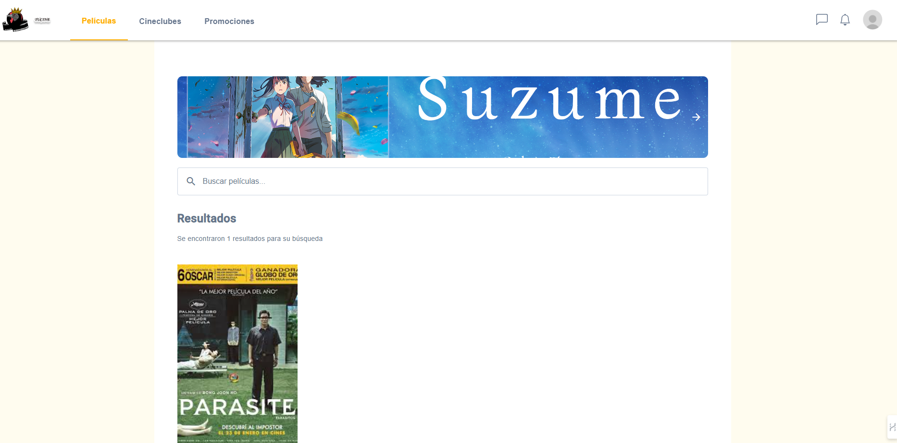
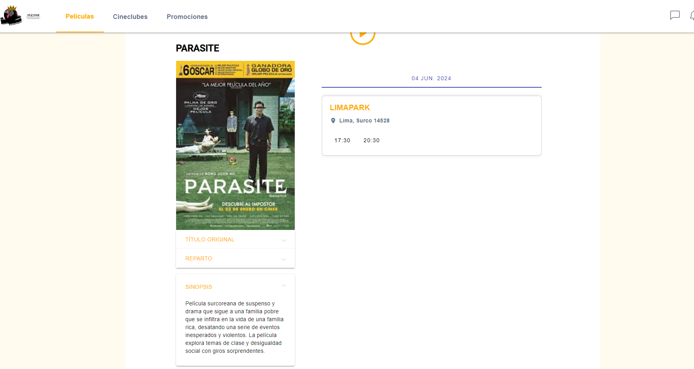
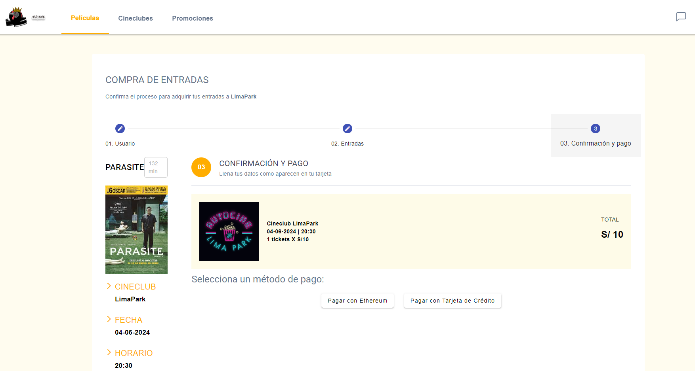
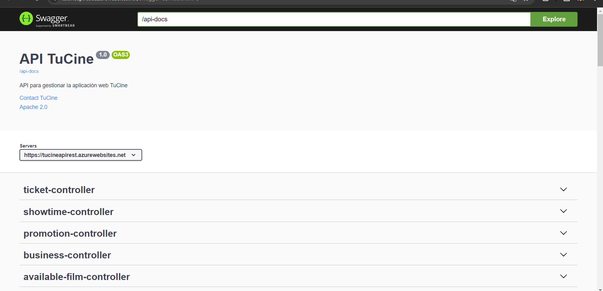
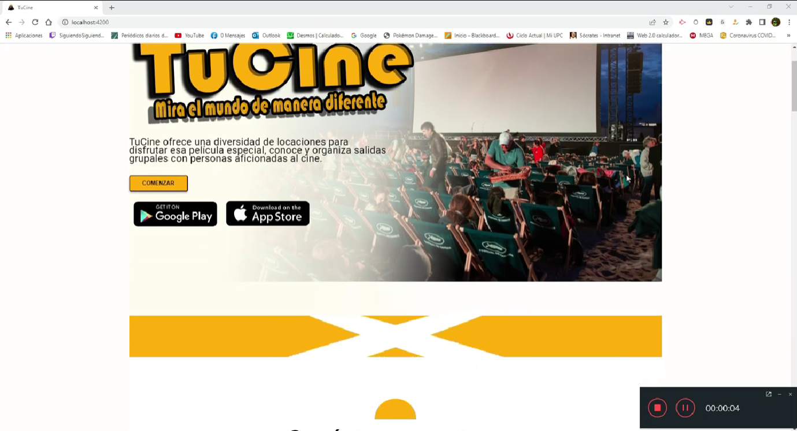

# Capítulo VII: Product Implementation, Validation & Deployment

## 7.1. Software Configuration Management

### 7.1.1. Software Development Environment Configuration

Utilizaremos principalmente los siguientes IDEs:

- Visual Studio Code (https://code.visualstudio.com/ ) o WebStorm (https://www.jetbrains.com/webstorm/ ), cada una con la configuración debida para no generar conflictos con las carpetas ‘.idea’ y ‘.vscode’.
- IntelliJ IDEA Ultimate (https://www.jetbrains.com/idea/ ) para la implementación de las APIs.
  Como herramientas de desarrollo se utilizará:
- Node.js (https://nodejs.org/ ) en su última versión disponible de tipo Long-Term Support (LTS), la cual en este momento es la versión 16.
  Como administrador de dependencias se utilizará:
- NPM 8 (https://npmjs.com/ ), el cual es el por defecto actualmente con Node.js 16. Este será instalado a través de nvm, ya sea su versión para Linux (https://github.com/nvmsh/nvm ) o Windows (https://github.com/coreybutler/nvm-windows ).
  Para el desarrollo del frontend:
- Se hará uso del framework Angular CLI la versión 15.1.6 (https://angular.io/quick-start ). Como framework de diseño se usará Angular Material (https://material.angular.io/ ).
  Para el desarrollo del backend, utilizaremos:
- Java (https://docs.oracle.com/en/java/ ) en su versión 16.

Como herramientas:

- SaSS.
- GitHub (https://github.com/ ) como herramienta de colaboración de código.
- Jira Software (https://www.atlassian.com/software/jira) para la 5 CHAPTER 100 elaboración del Product Backlog.
- Vertabelo (https://vertabelo.com/) será utilizado para el desarrollo del diagrama de bases de datos.
- LucidChart (https://www.lucidchart.com/) para la creación de diagramas diversos.

### 7.1.2. Source Code Management

Utilizaremos GitHub para llevar el control de nuestras versiones de desarrollo, hemos creado una organización llamada SI9ATechSolution en las que tenemos todos los repositorios necesarios: https://github.com/SI9ATechSolution . Asimismo, se adjuntan los enlaces correspondientes a los repositorios de cada una de las soluciones implementadas.

| Solución | Nombre de repositorio | Enlace                                                                                                         |
| -------- | --------------------- | -------------------------------------------------------------------------------------------------------------- |
| Backend  | Backend               | [https://github.com/TechSolution-ArquiTectura/Backend](https://github.com/TechSolution-ArquiTectura/Backend)   |
| Frontend | Frontend              | [https://github.com/TechSolution-ArquiTectura/Frontend](https://github.com/TechSolution-ArquiTectura/Frontend) |

### 7.1.3. Source Code Style Guide & Conventions

Para las convenciones o estilos de programación, seguiremos convenciones básicas de camelCase y UpperCamelCase según el caso. Además, la guía de estilo de Google para programar en HTML y CSS (Google HTML/CSS Style Guide).
En cuanto a las convenciones para el control de versiones, utilizaremos conventional commits tanto para la creación de ramas como para la creación de commits.
Ejemplo:

- Rama: feature/us-xx
- Commit: feat(ui): added main component template.
  Con respecto a la creación de ramas, se utilizarán feature branches siguiendo el modelo de GitFlow, con la nomenclatura mencionada previamente. Nuestra rama principal será la rama main, la cual contendrá nuestra versión de la aplicación que se encuentra en producción. Todas las feature branches y hotfixes se realizarán a esta rama, la cual será desplegada automáticamente gracias a la integración con Cloudflare Pages.
  SS

### 7.1.4. Software Deployment Configuration

Para el despliegue de la aplicación web se utilizarán dos servicios en la nube en su versión gratuita.
Aplicación frontend:
Para el despliegue del frontend en Angular se utilizará GitHub Pages (https://pages.github.com/). Para ello, se deberán seguir los siguientes pasos:

1. Instalar Angular CLI gh-pages como dependencia del proyecto:
   $ npm i angular-cli-ghpages –save-dev

2. Ejecutar la compilación de la aplicación en un servidor remoto de gh-pages a través del comando:
   $ ng build --prod --base-href "https://GithubUserName.github.io/GithubRepoName/"

3. Implementar en gh-pages utilizando angular-cli-ghpages:
   $ npx angular-cli-ghpages --dir=dist/nombre-proyecto

Aplicación backend:

Para el despliegue del backend en Java 16 se utilizará el servicio Railway (https://railway.app/). Para ello, se deberá seguir los siguientes pasos:

1. Cambiar el JDK a uno admitido por el servicio: (19, 17, 11, 8).
2. Vincular el repositorio de GitHub con Railway.
3. Realizar el despliegue continuo.

## 7.2. Solution Implementation

### 7.2.1. Sprint 1

#### 7.2.1.1. Sprint Planning 1

| Sprint #                            | Sprint 1                                                                                                                                                                                 |
| ----------------------------------- | ---------------------------------------------------------------------------------------------------------------------------------------------------------------------------------------- |
| **Sprint Planning Background**      |                                                                                                                                                                                          |
| Date                                | 27/05/2023                                                                                                                                                                               |
| Time                                | 09:00 AM                                                                                                                                                                                 |
| Location                            | Reunión virtual mediante la aplicación Discord                                                                                                                                           |
| Prepared by                         | Cristian Aldair Bonifacio                                                                                                                                                                |
| **Attendees (to planning meeting)** | Fiestas Axel , Almeyda Fredy, Chincha Alessandro , Vasquez Tania                                                                                                                         |
| **Sprint Goal & User Stories**      |                                                                                                                                                                                          |
| Sprint 1 Goal                       | Implementar la funcionalidad de pago con MetaMask en la aplicación Angular, permitiendo a los usuarios conectarse a sus billeteras Ethereum y realizar pagos utilizando la criptomoneda. |
| Sprint 1 Velocity                   | Para este sprint hemos considerado aceptar como máximo 36 story points.                                                                                                                  |
| Sum of Story Points                 | 36                                                                                                                                                                                       |

#### 7.2.1.2. Sprint Backlog 1.

**Sprint 1: Implementar la funcionalidad de pago con MetaMask**

| User Story ID | Title                                                            | ID  | Task Title                                                | Description                                                                       | Estimation (Hours) | Assigned To        | Status     |
| ------------- | ---------------------------------------------------------------- | --- | --------------------------------------------------------- | --------------------------------------------------------------------------------- | ------------------ | ------------------ | ---------- |
| US007         | Reservar ticket                                                  | T10 | Reservar un boleto exitosamente                           | Implementar la lógica para reservar un boleto exitosamente                        | 5                  | Axel Fiestas       | Done       |
|               |                                                                  | T11 | Ver información de la película y funciones disponibles    | Mostrar la información de la película y las funciones disponibles                 | 3                  | Tania Vásquez      | Done       |
| US008         | Pagar boleto reservado en pasarela con diversas opciones de pago | T12 | Validación de número de tarjeta no admitida               | Implementar la validación del número de tarjeta de una red de pago no admitida    | 4                  | Almeyda Fredy      | In process |
|               |                                                                  | T13 | Validación de número de tarjeta admitida                  | Implementar la validación del número de tarjeta de una red de pago admitida       | 4                  | Almeyda Fredy      | In process |
|               |                                                                  | T14 | Validación de datos no admitidos                          | Implementar la validación de datos no admitidos para la tarjeta seleccionada      | 5                  | Chincha Alessandro | To-do      |
|               |                                                                  | T15 | Validación de datos admitidos                             | Implementar la validación de datos admitidos para la tarjeta seleccionada         | 5                  | Chincha Alessandro | To-do      |
|               |                                                                  | T16 | Manejo de fondos insuficientes                            | Implementar el manejo de fondos insuficientes durante la transacción              | 4                  | Cristian Aldair    | To-do      |
|               |                                                                  | T17 | Manejo de fondos suficientes                              | Implementar el manejo de fondos suficientes durante la transacción                | 4                  | Cristian Aldair    | To-do      |
|               |                                                                  | T18 | Integración de MetaMask                                   | Implementar la integración con MetaMask para pagos con criptomonedas              | 6                  | Axel Fiestas       | Done       |
|               |                                                                  | T19 | Validación de MetaMask no instalado o sin sesión iniciada | Manejar el caso en el que MetaMask no está instalado o la sesión no está iniciada | 4                  | Axel Fiestas       | In process |
|               |                                                                  | T20 | Validación de MetaMask instalado y con sesión iniciada    | Manejar el caso en el que MetaMask está instalado y la sesión está iniciada       | 4                  | Axel Fiestas       | In process |
|               |                                                                  | T21 | Transacción de criptomonedas exitosa                      | Implementar la lógica para manejar una transacción de criptomonedas exitosa       | 5                  | Tania Vásquez      | To-do      |
|               |                                                                  | T22 | Transacción de criptomonedas fallida                      | Implementar la lógica para manejar una transacción de criptomonedas fallida       | 5                  | Tania Vásquez      | To-do      |
| TS010         | Desarrollar API para iniciar el pago con MetaMask                | T23 | Implementación del endpoint /api/payments/metamask/start  | Implementar el endpoint para iniciar el pago con MetaMask                         | 6                  | Chincha Alessandro | In process |
| TS011         | Integrar smart contract para manejar pagos                       | T24 | Despliegue del smart contract                             | Desarrollar y desplegar el smart contract en la red Ethereum                      | 8                  | Cristian Aldair    | In process |
|               |                                                                  | T25 | Confirmación de transacción por el smart contract         | Implementar la lógica para confirmar la transacción mediante el smart contract    | 6                  | Cristian Aldair    | To-do      |
| TS012         | API para verificar el estado del pago con MetaMask               | T26 | Implementación del endpoint /api/payments/metamask/verify | Implementar el endpoint para verificar el estado del pago con MetaMask            | 6                  | Almeyda Fredy      | In process |
|               |                                                                  | T27 | Manejo de pago no encontrado                              | Implementar la lógica para manejar el caso en el que el pago no es encontrado     | 4                  | Almeyda Fredy      | To-do      |

#### 7.2.1.3. Development Evidence for Sprint Review.

Durante este Sprint, se completó el desarrollo para implementar la funcionalidad de pago con MetaMask en la aplicación Angular. Se realizaron modificaciones significativas en la base de datos y el backend para permitir a los usuarios realizar pagos utilizando la criptomoneda ETH. En la base de datos, se simplificaron entidades redundantes y se agregaron atributos necesarios para integrarse con el API de MetaMask. Además, se introdujeron nuevas entidades clave para gestionar pagos y transacciones criptográficas. En el backend, se llevó a cabo una actualización del diseño para mejorar la organización y facilitar la integración con MetaMask, incluyendo la implementación de endpoints específicos para iniciar y verificar pagos, y la integración de un smart contract para gestionar transacciones en Ethereum. El equipo trabajó de manera colaborativa para cumplir con las tareas asignadas y se realizaron pruebas exhaustivas para asegurar la estabilidad y funcionalidad del sistema en diversos entornos. Además, se documentaron los cambios realizados y se crearon casos de prueba para garantizar la calidad del desarrollo.

| Repository                          | Branch  | Commit ID | Commit Message                       | Committed on (Date) |
| ----------------------------------- | ------- | --------- | ------------------------------------ | ------------------- |
| TechSolution-Arquitectura / Backend | main    | 06d9551   | Merge pull request #1 from...develop | 2024-06-03          |
| TechSolution-Arquitectura / Backend | main    | 65f06b0   | fix: Sign in controller              | 2024-06-03          |
| TechSolution-Arquitectura / Backend | develop | 65f06b0   | fix: Login an register               | 2024-06-03          |
| TechSolution-Arquitectura / Backend | develop | 65f06b0   | fix (\*) - Step 3 of payment method  | 2024-06-03          |

_Network_

#### 7.2.1.4. Testing Suite Evidence for Sprint Review

### Feature: US007 Reservar ticket

**Scenario: Reservar un boleto exitosamente**

- **Given** Implementar la lógica para reservar un boleto exitosamente
- **When** Axel Fiestas reserva un boleto
- **Then** El boleto se reserva exitosamente

**Scenario: Ver información de la película y funciones disponibles**

- **Given** Mostrar la información de la película y las funciones disponibles
- **When** Tania Vásquez consulta la información de la película y las funciones disponibles
- **Then** La información de la película y las funciones disponibles se muestra correctamente

### Feature: US008 Pagar boleto reservado en pasarela con diversas opciones de pago

**Scenario: Validación de número de tarjeta no admitida**

- **Given** Implementar la validación del número de tarjeta de una red de pago no admitida
- **When** Almeyda Fredy ingresa un número de tarjeta no admitida
- **Then** La validación del número de tarjeta no admitida se realiza correctamente

**Scenario: Validación de número de tarjeta admitida**

- **Given** Implementar la validación del número de tarjeta de una red de pago admitida
- **When** Almeyda Fredy ingresa un número de tarjeta admitida
- **Then** La validación del número de tarjeta admitida se realiza correctamente

**Scenario: Validación de datos no admitidos**

- **Given** Implementar la validación de datos no admitidos para la tarjeta seleccionada
- **When** Chincha Alessandro ingresa datos no admitidos para la tarjeta seleccionada
- **Then** La validación de datos no admitidos se realiza correctamente

**Scenario: Validación de datos admitidos**

- **Given** Implementar la validación de datos admitidos para la tarjeta seleccionada
- **When** Chincha Alessandro ingresa datos admitidos para la tarjeta seleccionada
- **Then** La validación de datos admitidos se realiza correctamente

**Scenario: Manejo de fondos insuficientes**

- **Given** Implementar el manejo de fondos insuficientes durante la transacción
- **When** Cristian Aldair realiza una transacción con fondos insuficientes
- **Then** El manejo de fondos insuficientes se realiza correctamente

**Scenario: Manejo de fondos suficientes**

- **Given** Implementar el manejo de fondos suficientes durante la transacción
- **When** Cristian Aldair realiza una transacción con fondos suficientes
- **Then** El manejo de fondos suficientes se realiza correctamente

**Scenario: Integración de MetaMask**

- **Given** Implementar la integración con MetaMask para pagos con criptomonedas
- **When** Axel Fiestas realiza un pago con MetaMask
- **Then** La integración de MetaMask se realiza correctamente

**Scenario: Validación de MetaMask no instalado o sin sesión iniciada**

- **Given** Manejar el caso en el que MetaMask no está instalado o la sesión no está iniciada
- **When** Axel Fiestas intenta realizar un pago con MetaMask no instalado o sin sesión iniciada
- **Then** La validación de MetaMask no instalado o sin sesión iniciada se realiza correctamente

**Scenario: Validación de MetaMask instalado y con sesión iniciada**

- **Given** Manejar el caso en el que MetaMask está instalado y la sesión está iniciada
- **When** Axel Fiestas intenta realizar un pago con MetaMask instalado y con sesión iniciada
- **Then** La validación de MetaMask instalado y con sesión iniciada se realiza correctamente

**Scenario: Transacción de criptomonedas exitosa**

- **Given** Implementar la lógica para manejar una transacción de criptomonedas exitosa
- **When** Tania Vásquez realiza una transacción de criptomonedas
- **Then** La transacción de criptomonedas se realiza exitosamente

**Scenario: Transacción de criptomonedas fallida**

- **Given** Implementar la lógica para manejar una transacción de criptomonedas fallida
- **When** Tania Vásquez realiza una transacción de criptomonedas
- **Then** La transacción de criptomonedas falla correctamente

### Feature: TS010 Desarrollar API para iniciar el pago con MetaMask

**Scenario: Implementación del endpoint /api/payments/metamask/start**

- **Given** Implementar el endpoint para iniciar el pago con MetaMask
- **When** Chincha Alessandro inicia el pago con MetaMask
- **Then** El pago con MetaMask se inicia correctamente

### Feature: TS011 Integrar smart contract para manejar pagos

**Scenario: Despliegue del smart contract**

- **Given** Desarrollar y desplegar el smart contract en la red Ethereum
- **When** Cristian Aldair despliega el smart contract
- **Then** El smart contract se despliega correctamente

**Scenario: Confirmación de transacción por el smart contract**

- **Given** Implementar la lógica para confirmar la transacción mediante el smart contract
- **When** Cristian Aldair confirma la transacción mediante el smart contract
- **Then** La transacción se confirma correctamente

### Feature: TS012 API para verificar el estado del pago con MetaMask

**Scenario: Implementación del endpoint /api/payments/metamask/verify**

- **Given** Implementar el endpoint para verificar el estado del pago con MetaMask
- **When** Almeyda Fredy verifica el estado del pago con MetaMask
- **Then** El estado del pago con MetaMask se verifica correctamente

**Scenario: Manejo de pago no encontrado**

- **Given** Implementar la lógica para manejar el caso en el que el pago no es encontrado
- **When** Almeyda Fredy busca un pago no encontrado
- **Then** El manejo de pago no encontrado se realiza correctamente

| Repository   | Branch | Commit Id | Commit Message             | Commit Message Body | Committed on (Date) |
| ------------ | ------ | --------- | -------------------------- | ------------------- | ------------------- |
| TestingSuite | main   | bd35a86   | API for MetaMask           |                     | Jun 3, 2024         |
| TestingSuite | main   | 3f8d0a8   | API payment verification   |                     | Jun 3, 2024         |
| TestingSuite | main   | 50d08c6   | Smart Contract for payment |                     | Jun 3, 2024         |
| TestingSuite | main   | d886a7c   | API for MetaMask           |                     | Jun 3, 2024         |
| TestingSuite | main   | b9d9b83   | fix: structure             |                     | Jun 3, 2024         |
| TestingSuite | main   | 4bac05d   | feat: add us-08            |                     | Jun 3, 2024         |
| TestingSuite | main   | 287e7af   | feat: add us-07            |                     | Jun 3, 2024         |

#### 7.2.1.5. Execution Evidence for Sprint Review.

- Web Aplication

La presente evidencia documenta el desarrollo de una aplicación web diseñada con el objetivo de integrar MetaMask como pasarela de pagos, permitiendo a los usuarios realizar transacciones utilizando criptomonedas. El proceso incluyó la creación de varias historias de usuario y tareas específicas para asegurar una implementación robusta y eficiente. Entre las tareas destacadas se encuentran la implementación de la API RESTful para iniciar y verificar pagos con MetaMask, la integración de contratos inteligentes para manejar transacciones en la blockchain de Ethereum, y la validación de diversos escenarios de pago, incluyendo la gestión de fondos insuficientes y errores de transacción. Cada componente fue desarrollado y asignado a miembros específicos del equipo, garantizando una distribución equilibrada del trabajo y un enfoque colaborativo en la realización de los objetivos del sprint. La integración de MetaMask ofrece a los usuarios una opción segura y moderna para realizar pagos, alineando la aplicación con las tendencias actuales en tecnología financiera y mejorando la experiencia del usuario final.

- Integración con MetaMask

#### 7.2.1.6. Services Documentation Evidence for Sprint Review.

| EndPoint        | Method | Description                                                            | Request                                                          | Response                                     |
| --------------- | ------ | ---------------------------------------------------------------------- | ---------------------------------------------------------------- | -------------------------------------------- |
|                 | GET    | http://localhost:8080/api/TuCine/v1/paymentMethods                     | http://localhost:8080/api/TuCine/v1/paymentMethods               | 200 OK, JSON con la lista de metodos de pago |
|                 | POST   | http://localhost:8080/api/TuCine/v1/paymentsMethods                    | http://localhost:8080/api/TuCine/v1/paymentsMethods              | 200 OK, JSON publicando metodo de pago       |
| Payment Methods | Delete | http://localhost:8080/api/TuCine/v1/paymentsMethods/{id}               | http://localhost:8080/api/TuCine/v1/paymentsMethods/{1}          | 200 OK, JSON Borrando la información         |
|                 | Delete | http://localhost:8080/api/TuCine/v1/paymentsMethods/{id}/user/{userId} | http://localhost:8080/api/TuCine/v1/paymentsMethods/{1}/user/{1} | 200 OK, JSON Borrando metodo del usuario     |
|                 | GET    | http://localhost:8080/api/TuCine/v1/paymentsMethods/user/{userId}      | http://localhost:8080/api/TuCine/v1/paymentsMethods/user/{1}     | 200 OK, JSON con la informacion del usuario  |

#### 7.2.1.7. Software Deployment Evidence for Sprint Review.

**Introduction**
Durante este Sprint, se realizaron actividades significativas relacionadas con el despliegue de software tanto para la API RESTful como para el desarrollo frontend. Estas actividades incluyeron la documentación de la API utilizando Swagger, la configuración y despliegue de la API en Azure, y el desarrollo y despliegue del frontend en Angular 17 con Netlify. A continuación se detallan los pasos realizados y se incluyen capturas de pantalla que documentan el proceso.

**API RESTful Deployment**
**Creación de Cuentas**

Se crearon cuentas en GitHub y Azure para los nuevos desarrolladores, proporcionando acceso a los repositorios de código y recursos necesarios para el despliegue.

**Configuración de Recursos en Azure**

Azure App Services: Se configuraron servicios de aplicaciones en Azure para alojar la API RESTful, asegurando un entorno escalable y seguro.
Azure SQL Database: Se configuró una base de datos SQL en Azure para manejar el almacenamiento y gestión de datos, permitiendo transacciones seguras y eficientes.

**Integración y Despliegue Continuo**

GitHub Actions: Se configuraron pipelines de CI/CD utilizando GitHub Actions para automatizar la compilación, pruebas y despliegue de la API RESTful en Azure.

**Documentación con Swagger**

Se utilizó Swagger para la documentación de la API, proporcionando una interfaz interactiva para explorar y probar los endpoints de la API.

**Frontend Deployment**

Configuración de Recursos en Netlify
Netlify: Se configuró Netlify para el despliegue del frontend desarrollado en Angular 17, proporcionando un entorno de alojamiento estático eficiente y fácil de usar.
Integración y Despliegue Continuo
GitHub Actions: Se configuraron pipelines de CI/CD para automatizar la compilación y despliegue del frontend en Netlify.

**Documentación de Cambios**
Se documentaron todos los cambios realizados en el proceso de despliegue, incluyendo:
Commits en el Repositorio: Cada cambio significativo en la configuración del despliegue se registró con mensajes de commit claros y detallados.
Casos de Prueba: Se crearon y ejecutaron casos de prueba para garantizar que cada parte del sistema se despliegue y funcione correctamente.

**Evidencia Visual**
Configuración de Azure App Services para la API RESTful
Pipeline de CI/CD en GitHub Actions para la API RESTful
Documentación de la API con Swagger
Configuración de Netlify para el Frontend
Pipeline de CI/CD en GitHub Actions para el Frontend

#### 7.2.1.8. Team Collaboration Insights during Sprint.

### 7.2.2. Sprint 2

#### 7.2.2.1. Sprint Planning 2

| Sprint #                            | Sprint 2                                                                                                                                                                                 |
| ----------------------------------- | ---------------------------------------------------------------------------------------------------------------------------------------------------------------------------------------- |
| **Sprint Planning Background**      |                                                                                                                                                                                          |
| Date                                | 17/06/2024                                                                                                                                                                               |
| Time                                | 21:00 PM                                                                                                                                                                                 |
| Location                            | Reunión virtual mediante la aplicación Discord                                                                                                                                           |
| Prepared by                         | Cristian Aldair Bonifacio                                                                                                                                                                |
| **Attendees (to planning meeting)** | Fiestas Axel , Almeyda Fredy, Chincha Alessandro , Vasquez Tania                                                                                                                         |
| **Sprint Goal & User Stories**      |                                                                                                                                                                                          |
| Sprint 2 Goal                       | Implementar el flujo de pago con Ethereum en MetaMask para la compra de entradas en Cineclub. |
| Sprint 2 Velocity                   | Para este sprint hemos considerado aceptar como máximo 21 story points.                                                                                                                  |
| Sum of Story Points                 | 21                                                                                                                                                                                       |

#### 7.2.2.2. Sprint Backlog 2

### Sprint 1: Implementar la funcionalidad de pago con MetaMask

| User Story ID | Title                                                            | ID  | Task Title                                                | Description                                                                       | Estimation (Hours) | Assigned To        | Status     |
| ------------- | ---------------------------------------------------------------- | --- | --------------------------------------------------------- | --------------------------------------------------------------------------------- | ------------------ | ------------------ | ---------- |
| US007         | Reservar ticket                                                  | T7  | Reservar un boleto exitosamente                           | Implementar la lógica para reservar un boleto exitosamente                        | 5                  | Tania Vasquez       | Done       |
|               |                                                                  | T8  | Ver información de la película y funciones disponibles    | Mostrar la información de la película y las funciones disponibles                 | 3                  | Tania Vasquez      | Done       |
| US030         | Realizar pago con MetaMask en la aplicación cineclub             | T25 | Desarrollar interfaz de confirmación y selección de método de pago | Desarrollar la página de confirmación y pago donde el usuario pueda ver el resumen de la compra y seleccionar el método de pago deseado | 5 | Chincha Alessandro | Done |
| US030         | Realizar pago con MetaMask en la aplicación cineclub             | T26 | Integrar opción de pago con Ethereum                      | Añadir la opción de "Pagar con Ethereum" en la página de confirmación y pago     | 4                  | Axel Fiestas      | Done      |
| US030         | Realizar pago con MetaMask en la aplicación cineclub             | T27 | Implementar conversión de soles a Ethereum                | Desarrollar la funcionalidad para convertir el monto total en soles a Ethereum utilizando la tasa de cambio actual | 4 | Cristian Aldair    | Done |
| US030         | Realizar pago con MetaMask en la aplicación cineclub             | T28 | Mostrar valor equivalente en Ethereum y tarifas en MetaMask | Actualizar la interfaz para mostrar el valor equivalente en Ethereum y las tarifas estimadas cuando el usuario selecciona pagar con Ethereum | 4 | 	 Fredy Almeyda       | Done |
| US030         | Realizar pago con MetaMask en la aplicación cineclub             | T29 | Integrar MetaMask para confirmación de transacciones      | Implementar la integración con MetaMask para que los usuarios puedan revisar y confirmar la transacción | 6 | Axel Fiestas      | Done |
| US030         | Realizar pago con MetaMask en la aplicación cineclub             | T30 | Verificar transacción en la blockchain                    | Desarrollar la funcionalidad para verificar que la transacción ha sido exitosa en la blockchain | 5 | Fredy Almeyda      | Done |
| US030         | Realizar pago con MetaMask en la aplicación cineclub             | T31 | Mostrar mensaje de "Reserva exitosa"                      | Implementar la funcionalidad para mostrar un mensaje de "Reserva exitosa" una vez que se haya verificado la transacción | 4 | Chincha Alessandro | Done |

#### 7.2.2.3. Development Evidence for Sprint Review

Durante este sprint, se implementaron funcionalidades de pago utilizando MetaMask en la aplicación frontend. Se realizaron modificaciones importantes, como la conversión automática del monto total en soles al valor equivalente en criptomonedas. De esta manera, el usuario puede realizar el pago de forma sencilla sin preocuparse por la conversión. Además, se añadió la capacidad de realizar operaciones simuladas con criptomonedas (Específicamente Sepolia), lo cual permite realizar pruebas y verificar que los pagos se procesen correctamente.En el backend, fue necesario actualizar la base de datos debido a la expiración del servicio de alojamiento anterior.

| Repository                           | Branch  | Commit ID | Commit Message                                                                                      | Committed on (Date) |
| ------------------------------------ | ------- | --------- | --------------------------------------------------------------------------------------------------- | ------------------- |
| TechSolution-Arquitectura / Frontend | develop | 06d9551   | feat: Add EthPaymentService for connecting wallets and making payments                              | 2024-06-12          |
| TechSolution-Arquitectura / Frontend | develop | 65f06b0   | feat: Update booking-stepper.component.html with payment options and Ethereum payment functionality | 2024-06-12          |
| TechSolution-Arquitectura / Frontend | develop | 65f06b0   | feat: Remove commented out code in Cryptomus component files                                        | 2024-06-12          |
| TechSolution-Arquitectura / Frontend | develop | 65f06b0   | feat: basic currency convert PEN to ether                                                           | 2024-06-12          |
| TechSolution-Arquitectura / Frontend | develop | 65f0640   | feat: coin market service                                                                           | 2024-06-14          |
| TechSolution-Arquitectura / Frontend | develop | 65506b0   | feat: update service                                                                                | 2024-06-14          |
| TechSolution-Arquitectura / Frontend | develop | 65fasb0   | feat: Update booking-stepper.component.ts with HttpClient.....                                      | 2024-06-19          |
| TechSolution-Arquitectura / Frontend | develop | 65306b0   | feat: Add Ethereum payment functionality and switch to Base Sepolia network                         | 2024-06-19          |
| TechSolution-Arquitectura / Frontend | develop | 61236b0   | chore: Update proxy.conf.json to disable secure flag for /api endpoint                              | 2024-06-19          |

#### 7.2.2.4. Testing Suite Evidence for Sprint Review

### Feature: US030 Realizar pago con MetaMask en la aplicación Cineclub

Como cinéfilo,
Quiero pagar mis entradas utilizando MetaMask
Para simplificar el proceso de compra con criptomonedas.

**Scenario: Selección de Entradas**

- **Given** el usuario ha seleccionado una película y el número de entradas
- **When** el usuario revisa el resumen de la compra
- **Then** el sistema debe mostrar el precio total en soles

**Scenario: Elección del Método de Pago**

- **Given** que el usuario está en la página de confirmación y pago
- **When** el usuario selecciona "Pagar con Ethereum"
- **Then** el sistema debe mostrar la opción de pagar con MetaMask y convertir el monto total en soles a Ethereum

**Scenario: Conversión de Moneda**

- **Given** que el usuario ha seleccionado pagar con Ethereum
- **When** el sistema realiza la conversión del monto total en soles a Ethereum
- **Then** el usuario debe ver el valor equivalente en Ethereum y las tarifas estimadas en la ventana de MetaMask

**Scenario: Confirmación de Pago en MetaMask**

- **Given** que el usuario ha revisado los detalles de la transacción en MetaMask
- **When** el usuario confirma la transacción
- **Then** MetaMask debe procesar la transacción y mostrar una notificación de envío

**Scenario: Verificación de Transacción Exitosa**

- **Given** que el usuario ha confirmado la transacción en MetaMask
- **When** el sistema verifica la transacción en la blockchain
- **Then** el sistema debe mostrar un mensaje de "Reserva exitosa" y confirmar la compra de las entradas

| Repository   | Branch | Commit Id | Commit Message                   | Commit Message Body | Committed on (Date) |
| ------------ | ------ | --------- | -------------------------------- | ------------------- | ------------------- |
| TestingSuite | main   | 5c3b3e0   | fix: structure                   |                     | Jun 24, 2024        |
| TestingSuite | main   | d9612bc   | feat: add new scenario for us-30 |                     | Jun 24, 2024        |
| TestingSuite | main   | 50d08c6   | feat: add scenario for us-30     |                     | Jun 24, 2024        |
| TestingSuite | main   | d886a7c   | feat: added add us-30            |                     | Jun 24, 2024        |

## 7.3. Validation Interviews

### 7.3.1. Diseño de Entrevistas

Durante las entrevistas, nos presentaremos al entrevistado y explicaremos en qué consistirá la sesión.

**Segmento: Propietarios de cineclubs, cine cafés o cine bares**

- ¿Cómo consideras que la aplicación web puede beneficiar a tu negocio?
- ¿Encuentras la interfaz de la aplicación intuitiva y fácil de usar?
- ¿Qué funcionalidades específicas te gustaría tener en la aplicación para gestionar mejor tu cineclub?
- ¿Qué información consideras importante mostrar en la página de perfil de tu cineclub?
- ¿Cómo te gustaría interactuar con los cinéfilos a través de la aplicación?
- ¿Qué herramientas o características te parecerían útiles para promocionar eventos y atraer a más audiencia?
- ¿Consideras que la aplicación web proporciona suficiente visibilidad a tu cineclub en comparación con otros canales de promoción?
- ¿Qué aspectos del proceso de reserva de entradas o boletos te gustaría mejorar en la aplicación?
- ¿Cómo podríamos facilitar la gestión de horarios y programación de películas en la aplicación?
- ¿Tienes alguna otra sugerencia o comentario sobre la aplicación web para propietarios de cineclubs?

**Segmento: Cinéfilos**

- ¿Qué opinas de la experiencia de usar la aplicación web como cinéfilo?
- ¿Consideras que la interfaz de la aplicación es amigable y te permite encontrar fácilmente información sobre películas y eventos?
- ¿Qué funcionalidades adicionales te gustaría tener en la aplicación como cinéfilo?
- ¿Qué información sobre películas, horarios o eventos consideras más relevante y te gustaría encontrar fácilmente?
- ¿Cómo te gustaría interactuar con otros cinéfilos a través de la aplicación?
- ¿Qué características te gustaría tener para personalizar tus preferencias de películas y recibir recomendaciones personalizadas?
- ¿Encuentras que la aplicación te brinda suficiente información sobre los cineclubs y eventos de cine alternativo?
- ¿Qué aspectos del proceso de reserva de entradas o boletos te gustaría mejorar en la aplicación?
- ¿Cómo podríamos facilitar la exploración y descubrimiento de películas y eventos interesantes en la aplicación?
- ¿Tienes alguna otra sugerencia o comentario sobre la aplicación web para cinéfilos?

### 7.3.2. Registro de Entrevistas

### Cinéfilos:

#### Primera entrevista

- **Entrevistado:** Delia Vasquez
- **Edad:** 20 años
- **Residencia:** Surco
- **Ocupación:** Estudiante
- **Entrevistador:** Alan Galavis
- **Enlace:** [Entrevista Delia Vasquez](https://upcedupe-my.sharepoint.com/:v:/g/personal/u202010840_upc_edu_pe/EXVSje4cqFRBidCzJco_4K4Bx_1WVFL9MqXq1aNDwVt87w?nav=eyJyZWZlcnJhbEluZm8iOnsicmVmZXJyYWxBcHAiOiJTdHJlYW1XZWJBcHAiLCJyZWZlcnJhbFZpZXciOiJTaGFyZURpYWxvZy1MaW5rIiwicmVmZXJyYWxBcHBQbGF0Zm9ybSI6IldlYiIsInJlZmVycmFsTW9kZSI6InZpZXcifX0%3D&e=lQqA7Z)

Delia es una estudiante universitaria que en sus tiempos libres disfruta de ver películas de nicho. Está familiarizada con el concepto de “cineclubes” y afirma que la plataforma presentada le resulta de utilidad para descubrir nuevos filmes de interés y formar parte de una comunidad amante de sus mismos intereses. Asegura que la distribución de la información es apropiada y accesible, adicionalmente indica que los colores son llamativos. Delia finaliza la entrevista con un mensaje de aprobación hacia el proyecto.

#### Segunda entrevista

- **Entrevistado:** Yosef Vásquez Carrión
- **Edad:** 20 años
- **Residencia:** San Martín de Porres
- **Ocupación:** Estudiante
- **Entrevistador:** Tania Vásquez
- **Enlace:** [Entrevista Yosef Vásquez Carrión](https://upcedupe-my.sharepoint.com/:v:/g/personal/u202010840_upc_edu_pe/EXVSje4cqFRBidCzJco_4K4Bx_1WVFL9MqXq1aNDwVt87w?nav=eyJyZWZlcnJhbEluZm8iOnsicmVmZXJyYWxBcHAiOiJTdHJlYW1XZWJBcHAiLCJyZWZlcnJhbFZpZXciOiJTaGFyZURpYWxvZy1MaW5rIiwicmVmZXJyYWxBcHBQbGF0Zm9ybSI6IldlYiIsInJlZmVycmFsTW9kZSI6InZpZXcifX0%3D&e=lQqA7Z)

En la entrevista Yosef menciona que la usabilidad para acceder a las funcionalidades es sencilla y fácil, por lo que no hay mayor confusión en el flujo de reserva. Sin embargo, menciona que sería genial si para los datos como correo electrónico fueran sugeridos cuando tenga que completar algún otro campo que requiera el mismo dato. Por otro lado, menciona que en los métodos de pagos se podrían incluir las que están en tendencia como Yape, Plin y Paypal. Además, como sugerencia menciona que en la sección de comentarios cada usuario debería tener un perfil público en el cual se puedan observar las películas que ellos marcan como favorito y de esa forma descubrir más contenido. Perfiles con alto nivel actividad tienden a influir y generar curiosidad por las películas que consideran de calidad, de esa forma se podría generar una comunidad más activa.

#### Tercera entrevista

- **Entrevistado:** Sergio Velásquez
- **Edad:** 27 años
- **Residencia:** San Borja
- **Ocupación:** Senior O&M Specialist
- **Entrevistador:** Andrés Soto
- **Enlace:** [Entrevista Sergio Velásquez](https://upcedupe-my.sharepoint.com/:v:/g/personal/u202010840_upc_edu_pe/EXVSje4cqFRBidCzJco_4K4Bx_1WVFL9MqXq1aNDwVt87w?nav=eyJyZWZlcnJhbEluZm8iOnsicmVmZXJyYWxBcHAiOiJTdHJlYW1XZWJBcHAiLCJyZWZlcnJhbFZpZXciOiJTaGFyZURpYWxvZy1MaW5rIiwicmVmZXJyYWxBcHBQbGF0Zm9ybSI6IldlYiIsInJlZmVycmFsTW9kZSI6InZpZXcifX0%3D&e=lQqA7Z)

Durante la entrevista, Sergio pudo explorar la interfaz ofrecida por nuestra aplicación web, así como las características desarrolladas e implementadas. Considera que es una aplicación muy completa, con una usabilidad muy sencilla que permite al usuario ir directo a su objetivo. Además, menciona que sería de gran ayuda conectar dicha aplicación con un API de Google Maps para que se pueda ver mediante Google Maps la ubicación del cineclub, lo cual proporcionaría mayor comodidad al usuario al momento de buscar la dirección. De la misma forma, considera que la opción de un blog donde los cinéfilos puedan comunicarse mejoraría la interacción entre ellos.

#### Cuarta entrevista

- **Entrevistado:** Sergio Flores
- **Edad:** 20 años
- **Residencia:** Villa el Salvador
- **Ocupación:** Estudiante
- **Entrevistador:** Vanessa Flores
- **Enlace:** [Entrevista Sergio Flores](https://upcedupe-my.sharepoint.com/:v:/g/personal/u202010840_upc_edu_pe/EXVSje4cqFRBidCzJco_4K4Bx_1WVFL9MqXq1aNDwVt87w?nav=eyJyZWZlcnJhbEluZm8iOnsicmVmZXJyYWxBcHAiOiJTdHJlYW1XZWJBcHAiLCJyZWZlcnJhbFZpZXciOiJTaGFyZURpYWxvZy1MaW5rIiwicmVmZXJyYWxBcHBQbGF0Zm9ybSI6IldlYiIsInJlZmVycmFsTW9kZSI6InZpZXcifX0%3D&e=lQqA7Z)

Sergio es un estudiante de la Carrera de Ciencias de la Computación. Durante la entrevista interactuó con la página de TuCine y concluyó que en el perfil del cineclub se debería agregar más información y mejorar la calidad de los banners. Asimismo, considera que en los placeholders de los inputs se deberían colocar un ejemplo de como llenarlos. Finalmente comenta que también se debería de mejorar los colores de la aplicación.

### 7.3.3. Evaluaciones según heurísticas

Evaluaciones según heurísticas
Site o app a evaluar: TuCine
Tareas para evaluar:

- Modificar información de Cineclubs
- Editar perfil de usuario
- Agregar peliculas
- Registro y logueo del usuario

Tareas no incluidas en esta versión de evaluación:

- Notificaciones
- Mensajes

Escala de severidad:
Los errores serán puntuados tomando en cuenta la siguiente escala de severidad

| Nivel | Descripción                                                                                                                                                                                      |
| ----- | ------------------------------------------------------------------------------------------------------------------------------------------------------------------------------------------------ |
| 1     | Problema superficial: Puede ser fácilmente superado por el usuario o no sucede con mucha frecuencia. No necesita ser arreglado a corto plazo dada su poca disponibilidad de tiempo.              |
| 2     | Problema menor: Puede ocurrir un poco más frecuentemente o es un poco más difícil de superar por el usuario. Se le debe asignar una prioridad baja resolviendo de cara al siguiente lanzamiento. |
| 3     | Problema mayor: Ocurre frecuentemente o los usuarios no son capaces de resolverlos. Es importante que sean corregidos y se les debe asignar una prioridad alta.                                  |
| 4     | Problema crítico: Un error del sistema completo que impide al usuario continuar con el uso de la herramienta. Es imperativo que sea corregido antes del lanzamiento.                             |

| #   | Problema                                                                                             | Escala de severidad | Heurística/Principio violada(o) |
| --- | ---------------------------------------------------------------------------------------------------- | ------------------- | ------------------------------- |
| 1   | La sección de perfil de películas presenta un estilo de diseño diferente al resto de la aplicación   | 4                   | Consistencia y estándares       |
| 2   | La sección de Mis grupos presenta un esquema visual diferente a los demás secciones de la aplicación | 3                   | Consistencia y estándares       |
| 3   | La sección de promociones no está implementada                                                       | 4                   | Visibilidad al sistema          |
| 4   | No se pueden revisar notificaciones                                                                  | 3                   | Libertad y control del usuario  |
| 5   | No existe una sección que muestre un mensaje entre el propietario de cineclub y el cinéfilo          | 3                   | Libertad y control del usuario  |

**Problema:** Mensajes de error poco claros al ingresar datos de la tarjeta.

**Severidad:** 2 (Problema menor).

**Heurística violada:** Prevención de errores.

**Recomendación:** Proporcionar mensajes de error más claros y sugerencias específicas para corregirlos, como “4432 4253 4523 5325” o “Revise el número de tarjeta e ingrese los 16 dígitos”.

## 7.4. Video About-the-Product

Enlace: https://www.youtube.com/watch?v=e30ivvQYvf8

# Conclusiones

- Tras finalizar el entregable del primer documento, concluimos que el trabajo en equipo permite desarrollar y completar el trabajo correctamente. Pues el equipo colaboró con el avance de cada integrante, al ofrecer ayuda. El uso de técnicas como Lean UX, entrevistar, crear User Stories, permitió que se entienda a los segmentos objetivos.

- Es importante considerar soluciones que actualmente no existen en el mercado de cine clubs, con respecto al cliente y la promoción de las películas. Es por ello por lo que la aplicación busca facilitar el proceso de compra y acceso a información de los usuarios, mediante la creación de promociones y post del cine club. De esta forma beneficiando al cinéfilo y al mismo cine club.

- Al diseñar la plataforma se tomó en cuenta la experiencia de usuario. Pues los usuarios suelen tener ciertas expectativas en cuanto a la interfaz. Es por ello por lo que buscamos satisfacer dichas expectativas creando una interfaz amigable e intuitiva.

- La opción que los usuarios busquen cine clubes según el nombre de una película permite que algunos cines clubes menos conocidos puedan volverse más conocidos al promocionar ciertas películas.

- La colaboración del equipo al juntarnos a realizar reuniones casi inter diariamente permitió que podamos avanzar grandes cantidades de trabajo en poco tiempo. De la misma forma pudimos colaborar con los miembros para ayudar a solucionar problemas.

- Se logró distribuir de manera equitativa los user stories que los desarrolladores seleccionaron para realizar el entregable. Lo que permitió que durante el desarrollo no se necesite que los desarrolladores abandonen sus labores para ayudar a resolver otros problemas.

- El documentar bugs permitió que podamos identificar los errores y demostrar las causas de retrasos y fallos en la aplicación. Además, generó que demostremos una mejora continua.

- Al considerar la fase de testing como una etapa previa al “Done” en el tablero Kanban, garantizó que el resultado final sea de alta calidad y sin errores.

- Terminar la landing page nos permitió dedicar más tiempo al desarrollo de la aplicación web, de este modo pudimos continuar mejorando y desarrollando el mismo.

- La integración de tecnología emergente como el blockchain en nuestra aplicación de cine club representa un avance significativo en términos de seguridad y transparencia en las transacciones. El uso de blockchain para el procesamiento de pagos mediante criptomonedas, como Ethereum, a través de MetaMask, no solo ofrece a los usuarios una opción de pago innovadora y segura, sino que también abre nuevas oportunidades para el mercado de cine clubs al adoptar tecnologías de vanguardia. Esto asegura que las transacciones sean inmutables y verificables, aumentando la confianza de los usuarios en nuestra plataforma.

# Recomendaciones

- Ofrecer opciones de personalización para que los usuarios puedan adaptar la plataforma a sus necesidades individuales. Esto incluye configuraciones de usuario flexibles y opciones de interfaz personalizables.

- Mantener una comunicación constante y directa con los usuarios para realizar una mejora continua según sus necesidades. Esto puede lograrse a través de encuestas periódicas, feedback en tiempo real y foros de discusión dedicados.

- Promover la inclusión y diversidad en la plataforma, asegurando que sea accesible y atractiva para una amplia variedad de grupos demográficos. Esto incluye la consideración de diferentes idiomas, accesibilidad para personas con discapacidades y representación cultural diversa.

- Mejorar la gestión del tiempo y la disposición de las user stories a realizar. Implementar herramientas de gestión de proyectos efectivas y realizar revisiones periódicas de los avances para asegurar que las tareas se completen dentro de los plazos establecidos.

- Coordinar de manera óptima la disposición y horarios de las reuniones para maximizar la productividad del equipo. Establecer horarios de reuniones fijos y utilizar herramientas de programación para encontrar los momentos más convenientes para todos los miembros del equipo.

- Establecer colaboraciones con otros proyectos y plataformas basadas en blockchain para expandir las funcionalidades y el alcance de la plataforma de cine club. Esto podría incluir integraciones con otras aplicaciones descentralizadas (dApps) y servicios de blockchain.

# Bibliografía

- **As-is Scenario Map: Build a better understanding of your users’ current experience.**  
  Recuperado de: [https://www.ibm.com/design/thinking/page/toolkit/activity/as-is-scenario-map](https://www.ibm.com/design/thinking/page/toolkit/activity/as-is-scenario-map)  
  [Consulta: 28 de mayo de 2024].

- **Empathy Map: Build empathy for your users through a conversation informed by your team’s observations.**  
  Recuperado de: [https://www.ibm.com/design/thinking/page/toolkit/activity/empathy-map](https://www.ibm.com/design/thinking/page/toolkit/activity/empathy-map)  
  [Consulta: 2 de junio de 2024].

- **Empathy Mapping: The First Step in Design Thinking.**  
  Recuperado de: [https://www.nngroup.com/articles/empathy-mapping/](https://www.nngroup.com/articles/empathy-mapping/)  
  [Consulta: 5 de junio de 2024].

- **Gestión. (20 de diciembre de 2021). Industria peruana de cine crecerá 42% hasta el 2025, según PwC.**  
  Recuperado de: [https://gestion.pe/economia/empresas/industria-peruana-de-cine-crecera-42-hasta-el-2025-segun-pwc-noticia/?ref=gesr](https://gestion.pe/economia/empresas/industria-peruana-de-cine-crecera-42-hasta-el-2025-segun-pwc-noticia/?ref=gesr)  
  [Consulta: 15 de mayo de 2024].

- **How to create an Impact Map in 4 easy steps?**  
  Recuperado de: [https://uxpressia.com/blog/build-impact-map-4-easy-steps](https://uxpressia.com/blog/build-impact-map-4-easy-steps)  
  [Consulta: 28 de mayo de 2024].

- **Indeed Editorial Team (2021). How to Write a Problem Statement Step by Step (with an Example).**  
  Recuperado de: [https://www.indeed.com/career-advice/career-development/how-to-write-a-problem-statement](https://www.indeed.com/career-advice/career-development/how-to-write-a-problem-statement)  
  [Consulta: 29 de mayo de 2024].

- **Rivas Frías, Bruno. (2020). Cine de autor peruano en tiempos de globalización: entre la transgresión y la marginación. Revista de Comunicación, 19(2), 215-230.**  
  Recuperado de: [https://dx.doi.org/10.26441/rc19.2-2020-a12](https://dx.doi.org/10.26441/rc19.2-2020-a12)  
  [Consulta: 3 de junio de 2024].

- **To-be Scenario Map: Draft a vision of your user’s future experience to show how your ideas address their current needs.**  
  Recuperado de: [https://www.ibm.com/design/thinking/page/toolkit/activity/to-be-scenario-map](https://www.ibm.com/design/thinking/page/toolkit/activity/to-be-scenario-map)  
  [Consulta: 4 de junio de 2024].

- **Nakamoto, S. (2008). Bitcoin: A Peer-to-Peer Electronic Cash System.**  
  Recuperado de: [https://bitcoin.org/bitcoin.pdf](https://bitcoin.org/bitcoin.pdf)  
  [Consulta: 10 de junio de 2024].

- **Mougayar, W. (2016). The Business Blockchain: Promise, Practice, and the Application of the Next Internet Technology. Wiley.**  
  Recuperado de: [https://www.wiley.com/en-us/The+Business+Blockchain%3A+Promise%2C+Practice%2C+and+the+Application+of+the+Next+Internet+Technology-p-9781119300311](https://www.wiley.com/en-us/The+Business+Blockchain%3A+Promise%2C+Practice%2C+and+the+Application+of+the+Next+Internet+Technology-p-9781119300311)  
  [Consulta: 12 de junio de 2024].
