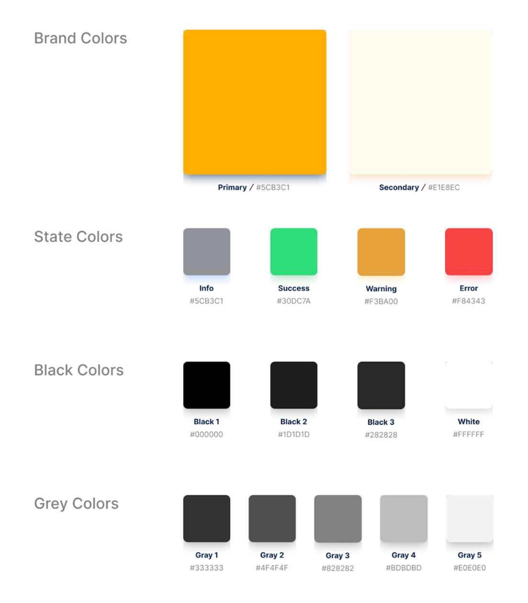

# Capítulo VI: Solution UX Design

## 6.1. Style Guidelines

### 6.1.1. General Style Guidelines

Como organización se considera el diseño web una parte muy importante del proyecto, ya que debe ser agradable, cómodo de navegar por nuestros clientes finales, estar en sintonía con nuestra marca y lo que queremos transmitir como empresa.
Para la elaboración de la guía de estilos de TuCine nos basaremos en 5 elementos esenciales:

**Misión:** Promover la cultura cinematográfica y apoyar el ciclo de vida del cine en Perú. A través de nuestra aplicación móvil, pretendemos distribuir y promover películas especializadas y no comerciales, apoyar a cineastas, artistas locales y crear una comunidad dedicada al arte cinematográfico.

**Visión:** Nuestra visión consta de ser una plataforma líder para la promoción y difusión de películas de nicho y no comerciales, los cuales serán reconocidos por la gran calidad y excelencia que proporciona nuestro servicio. Nos esforzamos por ser una empresa innovadora en la distribución cinematográfica y también por ser un punto de encuentro para cinéfilos y gente que disfruta del cine de nicho.

**Público Objetivo:** Cinéfilos de rango de edad entre 18 a 50 años con una preferencia por el cine alternativo, además, buscan conocer y compartir su afición con otras personas. Propietarios de cineclubes que necesiten una mayor visibilidad y que ofrecen como servicio la proyección de películas del género alternativo.

**Personalidad de la marca:** TuCine ofrece una diversidad de locaciones para disfrutar esa película especial, conoce y organiza salidas grupales con personas aficionadas al cine.

Valores fundamentales:
- Confianza, lealtad, seguridad y empatía. El deseo por mejorar y ofrecer un mejor servicio cada día.
- Dimensiones del tono de comunicación y lenguaje aplicado tomando en cuenta que nuestro público objetivo son personas que gustan de un arte más maduro elegimos un tono formal, pero a la vez amigable y respetuoso con el objetivo de que nuestros clientes se sientan cómodos con nuestro trato y el servicio brindado. 
- Del mismo modo, buscaremos lograr la confiabilidad de nuestros usuarios al contar con un equipo, testimonios o historias de clientes satisfechos con el servicio de TuCine.
- Las palabras banderas de nuestra marca serán las siguientes: novedoso, confiable, seguro, emocionante y divertido.

### Colors

### Typography

### Spacing

### Buttons

### 6.1.2. Web, Mobile & Devices Style Guidelines

Para la elaboración del Style Guidelines de la web de TuCine se utilizarán los componentes de PrimeNg. Primevue es una librería open source de desarrollo que nos brinda un conjunto de componentes (+80) de diseños llamativos y receptivos amigables con Angular y también disponibles en React, Vue y Java. Entre los componentes se implementaron los que más se relacionaban con el core del negocio. En el Style Guide se encuentran los botones de acciones y redes sociales. Los iconos categorizados por funcionalidad, los campos de texto, Breadcrumbs, Placeholders, entre otros. Una vista previa de estos componentes se puede ver en Figma. Para el desarrollo de nuestros mock-ups de la aplicación web, hemos utilizado pantallas comunes de la versión desktop.

## 6.2. Information Architecture

### 6.2.1. Organization Systems

Para la elaboración de la arquitectura de la información de la landing page se decidió usar el formato jerárquico común que se observa en la mayoría de las páginas web, ya que buscamos la facilidad de navegación y comodidad del usuario al momento de la interacción con ella.

El formato adoptado es el siguiente:
- La barra de navegación, la cual contendrá las secciones de la página y las redireccionará a cada una de ellas.
- Nombre y breve descripción: Una imagen que represente la idea central de la aplicación. 
- Características/features: Aquí se explican las funcionalidades que ofrece la aplicación, estas están en planeamiento y es muy posible su cambio en un futuro. 
- Enlace para descargar la aplicación: El objetivo final de esta página es que el usuario descargue la aplicación. 
- Footer:  Que contiene enlaces a las categorías principales, información de contacto, redes sociales y enlaces a textos legales.

Se navega dentro de la página por medio del scroll.

Dentro de la aplicación web, se organizó la lista de películas, cineclubes y publicaciones por orden de popularidad y con la opción de una sección de filtros para que sean ordenadas por categoría, cronología y tipo de audiencia.

### 6.2.2. Labeling Systems

- Encabezados (headings): Estas etiquetas benefician al usuario para poder comprender toda la información de un apartado en el que se encuentre con tan solo leerla.
- Etiquetas textuales: Son etiquetas que se usan comúnmente para indicar ciertos apartados. 
- Etiquetas icónicas (iconics labels): Consiste en utilizar imágenes para que esta etiqueta pueda tener significado pleno sin necesidad de texto adicional, pero, normalmente, van acompañadas de etiquetas textuales para que el usuario no se confunda. 

Estas dos etiquetas en cuestión se evidencian en la barra de navegación de nuestro mockup.

### 6.2.3. Searching Systems

En esta sección del informe se busca definir nuestra arquitectura de la información para que el usuario final no se vea abrumado con tanta información. La aplicación proporciona vasta información sobre recintos, películas y publicaciones es por ello por lo que se contará con los siguientes elementos:

Campo de búsqueda: Estará ubicada en la dentro de la barra de navegación, el usuario podrá ingresar la palabra que crea está asociada a la película, cineclub o publicación que busca.

Etiquetas: Los resultados más relevantes se mostrarán primero; sin embargo, los resultados pueden ser ordenados por medio de las etiquetas que aparecerán en la parte superior, ejemplo: Películas, Cineclubs y Publicaciones.

Por otro lado, la sección Películas y Cineclubs contará con la opción de filtrado.

### 6.2.4. SEO Tags and Meta Tags

Los Meta tags son etiquetas invisibles que brindaran datos sobre la página web a los motores de búsqueda y visitantes del sitio web, facilitan que los motores de búsqueda determinen el propósito de nuestra aplicación, por lo tanto, son vitales para el SEO.

- Title tag

        <head>
        <title>TuCine</title>
        </head>

- Meta description

        <head>
        <meta name="description" content="TuCine ofrece una diversidad de locaciones para disfrutar esa película especial, conoce y organiza salidas grupales con personas aficionadas al cine.">
        </head>

- Robot Meta tag

        <!DOCTYPE html>
        <html><head>
        <meta name="robots" content="noindex" />
        </head>
        <body>(…)</body>
        </html>

- Alt Text

    Las imágenes deben ser accesibles tanto para los motores de búsqueda como para las personas. Además, en caso no cargará la imagen proporciona una alternativa de texto a las imágenes que se mostrará.

        

        
        
        

- Keyword

        <meta name="keyword" content="cineclub, cine, cine alternativo, películas, autocinema, cinecafe,arte, intelectual">

- Author

        <meta name="author" content="TuCine">

### 6.2.5. Navigation Systems

A través de nuestra aplicación, los usuarios pueden navegar de manera intuitiva gracias al uso de lenguaje claro y conciso que caracteriza a cada sección. Pueden presionar en la palabra o íconos respectivos para dirigirse a la sección especificada. También, pueden utilizar los botones desplegados que intercomunican secciones y habilitan nuevas interacciones. Los usuarios pueden recorrer el contenido de manera aleatoria, ya que pueden acceder a cualquier sección en el momento que lo requieran. Evidentemente, las páginas de registro o inicio de sesión serán siempre primeras en caso el usuario aún no esté registrado o no haya iniciado sesión en la aplicación. 

## 6.3. Landing Page UI Design
### 6.3.1. Landing Page Wireframe

A continuación, podemos ver los diseños realizados para nuestro landing page de la aplicación, en la cual nuestros posibles usuarios podrán tener una vista previa de las funcionalidades de nuestra aplicación y lo que les podemos ofrecer. 

 

### 6.3.2. Landing Page Mock-up

En las siguientes imágenes se pueden apreciar los Mock-ups del landing page, considerando la estructura trabajada previamente en los wireframes. Se realizan en [Figma](https://www.figma.com/file/rgrAGjnnaYMRoAw2BYi3TV/TSP---G3?type=design&node-id=0%3A1&mode=design&t=oCjFgEkbYFda6weu-1).

## 6.4. Applications UX/UI Design
### 6.4.1. Applications Wireframes

- Registro / Inicio de sesión

- Sección Cineclubes

- Sección películas

- Sección Promociones

- Pasarela de pagos sección promociones

- Error al adquirir promociones

- Promoción adquirida

- Reseñar aplicación

- Perfil cineclub

- Perfil película

- Reservar asientos

- Perfil de usuario

[Enlace Figma](https://www.figma.com/file/rgrAGjnnaYMRoAw2BYi3TV/TSP---G3?type=design&node-id=0%3A1&mode=design&t=oCjFgEkbYFda6weu-1).

### 6.4.2. Applications Wireflow Diagrams.

**Reserva de una función por medio de la búsqueda de una película**

El usuario ingresa la película de su preferencia en el buscador global ubicado en la barra de navegación. Selecciona la imagen de la película, para luego mostrar la interfaz con la descripción de la película y los cineclubs disponibles para reservar.

**Reserva de una función por medio de la búsqueda de un cineclub**

El usuario ingresa el cineclub de su preferencia en el buscador global ubicado en la barra de navegación. Selecciona el slide de su preferencia, para luego mostrar el perfil del CineClub con las funciones disponibles.

**Adquisición de promoción**

El usuario ingresa a la sección promociones donde se mostrarán diferentes promociones e información acerca de ellas. Al seleccionar una promoción permitirá al usuario ingresar sus datos de facturación. Donde se validará el método de pago. 

**Publicación**

El usuario ingresa a la sección publicaciones donde se mostrarán diferentes publicaciones e información acerca de ellas, como la cantidad de likes, nombre del usuario y comentarios. Al seleccionar el botón “crear publicación” se le permitirá ingresar el texto que desea publicar para finalmente presionar el botón de aceptar y publicar el texto escrito. 

### 6.4.2. Applications Mock-ups

- Registro / Inicio de sesión

- Sección Cineclubes

- Sección películas

- Sección Promociones

- Pasarela de pagos sección promociones

- Error al adquirir promociones

- Promoción adquirida

- Reseñar aplicación

- Perfil cineclub

- Perfil película

- Reservar asientos

- Perfil de usuario

- Publicaciones

### 6.4.3. Applications User Flow Diagrams

**Reserva de una función por medio de la búsqueda de una película**

El usuario ingresa la película de su preferencia en el buscador global ubicado en la barra de navegación. Selecciona la imagen de la película, para luego mostrar la interfaz con la descripción de la película y los cineclubs disponibles para reservar.

**Reserva de una función por medio de la búsqueda de un cineclub**

El usuario ingresa el cineclub de su preferencia en el buscador global ubicado en la barra de navegación. Selecciona el slide de su preferencia, para luego mostrar el perfil del CineClub con las funciones disponibles.

**Adquisición de promoción**

El usuario ingresa a la sección promociones donde se mostrarán diferentes promociones e información acerca de ellas. Al seleccionar una promoción permitirá al usuario ingresar sus datos de facturación. Donde se validará el método de pago. 

**Publicación**

El usuario ingresa a la sección publicaciones donde se mostrarán diferentes publicaciones e información acerca de ellas, como la cantidad de likes, nombre del usuario y comentarios. Al seleccionar el botón “crear publicación” se le permitirá ingresar el texto que desea publicar para finalmente presionar el botón de aceptar y publicar el texto escrito. 

## 6.5. Applications Prototyping.

[Enlace de Microsoft Stream](https://upcedupe-my.sharepoint.com/:v:/g/personal/u20181b530_upc_edu_pe/EWE-iLHXc-pLiVYZi4nbBcIB2f0ibYLbCc3-cDIHUrFI9Q?e=gM924u)

