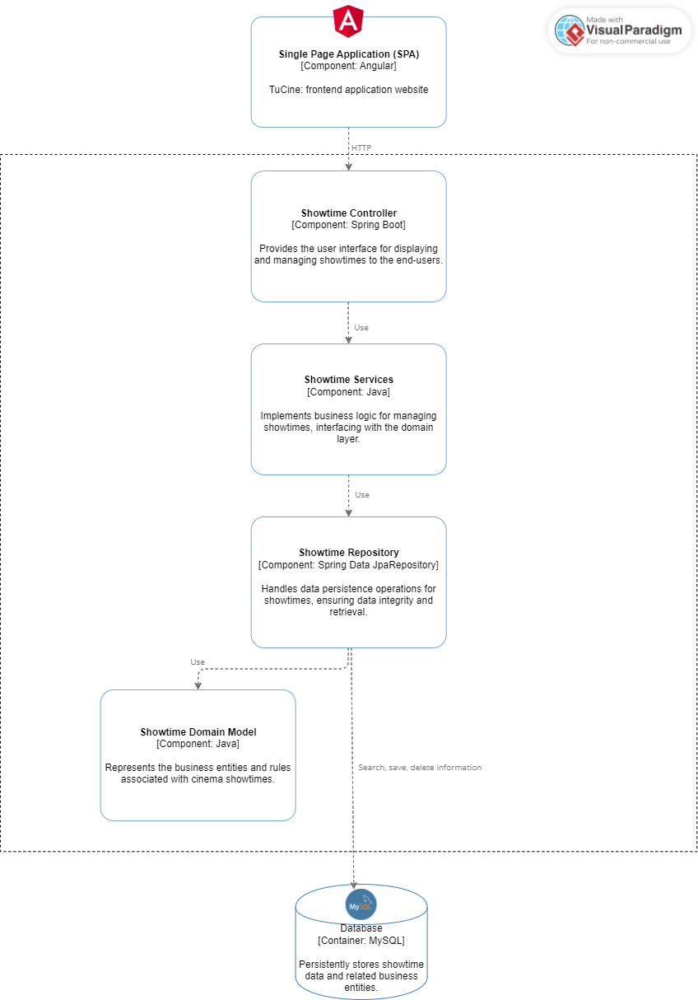
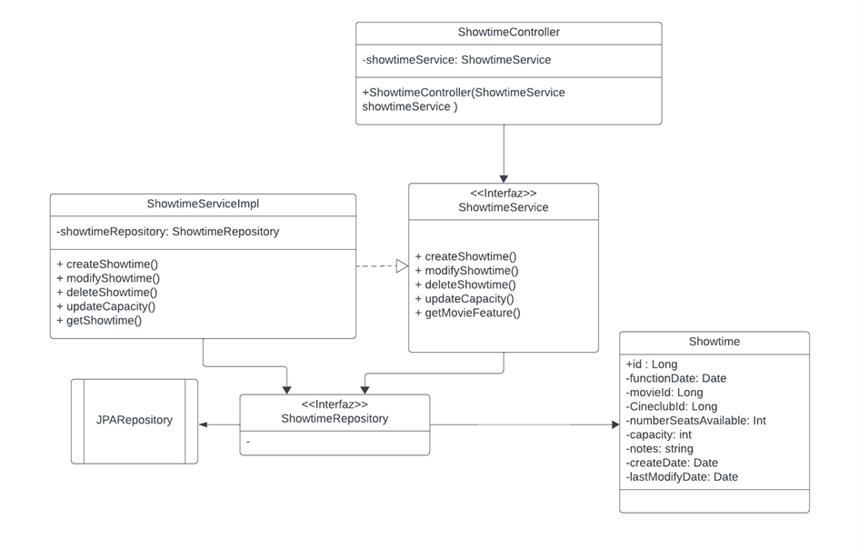
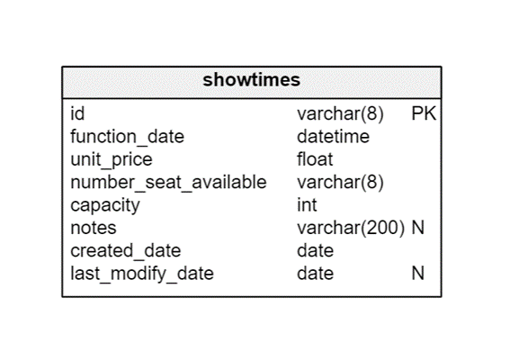

# 5.1 Bounded Context: Account Managment Bounded Context

## 5.1.1 Domain Layer

El contexto de "Account Management" se centra en la gestión de cuentas de usuarios, a bordando aspectos como la autenticación, la gestión de perfiles y la seguridad de la información asociada a las cuentas. Este contexto es crucial en sistemas que requieren la identificación y autorización de usuarios para acceder a funcionalidades específicas.

### Aggregate

El agregado principal en el contexto de "Account Management" podría ser la entidad User, que representa la información y el comportamiento asociado a un usuario dentro del sistema. Esta entidad encapsula los datos relacionados con un usuario y las operaciones que se pueden realizar sobre él.
    
### Entity

User: Representa a un usuario del sistema, con atributos como Id, firstname, lastname, birthdate, phone, email, hashed_password, numberDNI, bank_account, image_src, created_at, Gender_id, TypeUser_id.
### Value Objects

Gender: Representa el género de un usuario, con atributos como id y name.

TypeUser: Representa el tipo de usuario, con atributos como id y name.
### Domain Services

AuthenticationService: Gestiona la autenticación de usuarios, incluyendo la verificación de contraseñas y la generación de tokens de sesión.

ProfileService: Proporciona funcionalidades relacionadas con la gestión de perfiles de usuario, como la actualización de información personal y la configuración de preferencias.

SecurityService: Se encarga de garantizar la seguridad de la información asociada a las cuentas de usuario, implementando medidas como el hashing de contraseñas y la gestión de permisos.
### Repositories

UserRepository: Abstrae el acceso a datos relacionados con los usuarios, permitiendo operaciones como la creación, lectura, actualización y eliminación de registros de usuarios en la base de datos.

GenderRepository: Gestiona la persistencia de información relacionada con los géneros de los usuarios.

TypeUserRepository: Permite acceder y manipular información sobre los tipos de usuario en el sistema.

## 5.1.2 Interface Layer
En la Interface Layer, el UserController actúa como un punto de entrada para las solicitudes relacionadas con la gestión de usuarios, interactuando con el Domain Layer para ejecutar las operaciones correspondientes y devolver las respuestas adecuadas a los clientes. Este controlador facilita la interacción entre los usuarios y el sistema, proporcionando una interfaz amigable y segura para la gestión de cuentas de usuario.

Controllers
UserController: Controlador encargado de gestionar la información de los usuarios, maneja las solicitudes relacionadas con la creación, recuperación, actualización y eliminación de usuarios en el sistema. Proporciona endpoints para interactuar con las funcionalidades de gestión de cuentas de usuario a través de la interfaz de usuario.

El UserController puede tener métodos como:

CreateUser: Maneja las solicitudes de creación de nuevos usuarios en el sistema.

GetUser: Recupera la información de un usuario específico según su identificador.

UpdateUser: Gestiona las solicitudes de actualización de la información de un usuario existente.

DeleteUser: Maneja las solicitudes de eliminación de un usuario de la base de datos

## 5.1.3 Application Layer

El Application Layer se encarga de orquestar las operaciones de alto nivel relacionadas con la gestión de usuarios, utilizando los servicios de dominio proporcionados por el Domain Layer para realizar las operaciones necesarias de manera eficiente y coherente. Esto ayuda a mantener una separación clara de responsabilidades entre las diferentes capas del sistema y facilita la implementación de cambios y mejoras en el futuro.

### Services
UserManagementService: Este servicio encapsula la lógica de aplicación relacionada con la gestión de usuarios. Actúa como una capa intermedia entre los controladores de la interfaz de usuario y el Domain Layer, coordinando las operaciones necesarias para satisfacer las solicitudes del UserController.

El UserManagementService puede ofrecer métodos como:

createUser: Coordina la creación de un nuevo usuario, validando los datos proporcionados y utilizando el UserRepository para persistir la información en la base de datos.

getUserById: Recupera la información de un usuario específico utilizando el UserRepository y la devuelve al controlador de la interfaz de usuario correspondiente.

updateUser: Gestiona la actualización de la información de un usuario existente, asegurando la coherencia de los datos y utilizando el UserRepository para actualizar la información en la base de datos.

deleteUser: Coordina la eliminación de un usuario específico utilizando el UserRepository.

## 5.1.4 Infraestructure Layer

El Infrastructure Layer se encarga de la implementación concreta de los componentes necesarios para interactuar con el entorno externo al sistema, como la base de datos y otros servicios externos. Proporciona una capa de abstracción entre el Application Layer y los detalles específicos de implementación, lo que facilita la gestión de dependencias y la escalabilidad del sistema. Además, permite realizar cambios en la infraestructura subyacente sin afectar a la lógica de negocio del sistema.

### Repositories Implementations
UserRepositoryImpl: Implementación concreta del UserRepository que interactúa directamente con el sistema de almacenamiento de datos subyacente, como una base de datos relacional o no relacional. Proporciona métodos para ejecutar consultas y operaciones CRUD (Crear, Leer, Actualizar, Eliminar) relacionadas con los usuarios.
### Data Source Configuration
Configuración de la conexión a la base de datos: Este componente se encarga de establecer la conexión con la base de datos utilizada por el sistema, configurando parámetros como la URL de conexión, credenciales de autenticación y configuraciones de conexión específicas del proveedor de base de datos.
### External Services Integration
Integraciones externas: En esta capa también se pueden incluir componentes para integrar servicios externos necesarios para la gestión de usuarios, como servicios de autenticación externos o servicios de almacenamiento de archivos para las imágenes de perfil de los usuarios.
## 5.1.6 Bounded Context Software Architecture Component Level Diagrams

Este diagrama representa la arquitectura de componentes a nivel de contexto acotado del sistema, mostrando cómo se comunican los diferentes componentes dentro de cada contexto y cómo se conectan los contextos entre sí, así como los servicios externos utilizados por el sistema. Esta estructura facilita la comprensión de la interacción entre los diferentes elementos del sistema y proporciona una base para su diseño e implementación.

### Single Page App
Description: Interfaz de usuario basada en una sola página que permite a los usuarios interactuar con el sistema de gestión de cuentas.
#### Components:

UserAccountController: Controlador de la interfaz de usuario responsable de manejar las solicitudes del usuario y dirigirlas al UserAccountServices para su procesamiento.

Model: Representación de los datos y la lógica de negocio asociada en el lado del cliente.
### UserAccount Bounded Context

Description: Contexto del sistema que se ocupa de la gestión de cuentas de usuario.
#### Components:

UserAccountController: Controlador que recibe las solicitudes de la interfaz de usuario y las dirige al UserAccountServices para su procesamiento.

UserAccountServices: Servicios de aplicación encargados de la lógica de negocio relacionada con la gestión de cuentas de usuario, como la creación, actualización y eliminación de cuentas.

Model: Representación de los datos y la lógica de negocio asociada en el lado del servidor.
### Administration Cineclub Bounded Context

Description: Contexto del sistema dedicado a la administración del Cineclub.
#### Components:

AdministrationCineclubController: Controlador que maneja las solicitudes relacionadas con la administración del Cineclub.

AdministrationCineclubServices: Servicios de aplicación encargados de la lógica de negocio asociada con la administración del Cineclub, como la gestión de películas, horarios y ventas de entradas.

Model: Representación de los datos y la lógica de negocio asociada en el lado del servidor.
### External Services
Description: Servicios externos utilizados por el sistema.
#### Components:
SendGridAPI: API de SendGrid utilizada para el envío de correos electrónicos y notificaciones.

## 5.1.7 Bounded Context Software Architecture Layer Class Diagrams

### 5.1.7.1 Bounded Context Domain Layer Class Diagrams

### 5.1.7.2 Bounded Context Database Design Diagram

# 5.2 Bounded Context: Cineclub Administration Bounded Context

El bounded context de administracion de cineclub es el encargado de dirigir el
manejo del cineclub. Este bounded context será principalmente usado por el propietario
de cineclub, el cual decidirá que películas agregar o quitar de su cartelera.

## 5.2.1 Domain Layer

Las clases pertenecientes al dominio del bounded context de cineclub administration
serán las siguientes:
 

- Film: Representa una película, la cual puede ser agregada o quitada de cartelera del cineclub
- Cineclub: Representa el cineclub que maneja un propietario
- CineclubType: Representa el tipo de cineclub existente , existen un total de 4 tipos de cineclubs
- ContentRating: Representa el tipo de contenido al cual es dirigido una película. Ej: +18 , +14 , etc
- Award: Representa un premio, que puede haber ganado o no una películas
- Actor: Representa un actor, que puede tener una o varias participaciones en diversas películas
- Category: Representa una categoría perteneciente a una película. Ej: Ciencia Ficción, Terror, etc

## 5.2.2 Interface Layer

Las clases pertenecientes a la capa de interfaz del bounded context de cineclub administration
serán las siguientes:
 

- FilmController: Controlador para los procesos relacionados con el manejo de películas
- CineclubController: Controlador para los procesos relacionados con el manejo de cineclubes o un cineclub
- CineclubTypeController: Controlador para los procesos relacionados con el manejo de los tipos de cineclubes existentes.
- ContentRatingController: Controlador para los procesos relacionados con el manejo del contenido clasificado de las películas.
- AwardController: Controlador para los premios de películas
- ActorController: Controlador para los actores que pueden estar presentes en una o varias películas
- CategoryController: Controlador para los procesos relacionados a las categorías existentes para todas las películas

## 5.2.3 Application Layer

La capa de aplicación es la encargada de orquestar las operaciones de alto nivel relacionadas con la 
gestión de cineclubes existentes, utilizando servicios que están conectados a la capa de base de datos
para realizar las operaciones necesarias de manera eficiente y coherente. 

Services:

- FilmService: Este servicio se encarga de interactuar con la base de datos relacionada con las películas, dentro de sus
métodos u operaciones que puede realizar tenemos las siguientes:
  - createNewFilm: Creación de una nueva película para un cineclub
  - searchFilmInExteriorAPI: Búsqueda de una película a través de la API externa de The Movie Database
  - searchExistingFilm: Busqueda de una película existente
 
 
- CineclubService: Este servicio se encarga de interactuar con la base de datos relacionada con los cineclubes individuales 
pertenecientes a cada propietario, dentro de algunos de sus métodos u operaciones que puede realizar tenemos las siguientes:
  - createCineclub: Creación de un nuevo cineclub
  - modifyCineclub: Modificación de la información de un cineclub
  - deleteCineclub: Eliminación de un cineclub de un propietario
 
 
- CategoryService: Servicio encargado de interactuar con la base de datos relacionada con las categorías individuales de cada películas
, dentro de algunos de sus métodos u operaciones que puede realizar tenemos las siguientes:
    - createCategory: Creación de una nueva categoría para las película
    - modifyCategory: Modificación de una categoría existente
    - deleteCategory: Eliminación de una categoría

## 5.2.4 Infraestructure Layer

## 5.2.6 Bounded Context Software Architecture Component Level Diagrams

## 5.2.7 Bounded Context Software Architecture Layer Class Diagrams

### 5.2.7.1 Bounded Context Domain Layer Class Diagrams

### 5.2.7.2 Bounded Context Database Design Diagram

# 5.3 Bounded Context: Showtime Managment Bounded Context

El Bounded Context de Showtime encapsula la funcionalidad relacionada con la gestión de las proyecciones de películas en un cine. 

## 5.3.1 Domain Layer

### Entities

- **Showtime**: Representa una proyección específica de una película en un horario determinado.

### Value Objects

- **Schedule**: Puede ser un objeto de valor que indica la hora de inicio y fin de una función. Es inmutable y no tiene identidad propia.

### Aggregates

- **Showtime Aggregate**: Este sería el agregado raíz incluida la entidad Showtime y asociado al cineclub. Garantiza que no se superpongan las proyecciones en una sola sala.

### Domain Services

- **Scheduling Service**: Gestiona la logística de programación de proyecciones asegurando que no haya superposiciones horarias en la única sala del cine.

### Repositories

- **Showtime Repository**: Gestiona la recuperación y el almacenamiento de datos de proyección fundamentales para acceder a la información de proyección por cine y gestionar la programación.

## 5.3.2 Interface Layer

### Controllers

- **ShowtimeController**: Gestiona las solicitudes para las proyecciones de películas.

### DTOs

- **ShowtimeDTO**: Contiene los datos de una proyección como la película, la hora de inicio y fin y la sala. Se utiliza para transportar datos de las proyecciones entre el cliente y el servidor.

## 5.3.3 Application Layer

### Command Handlers

- **CreateShowtimeCommandHandler**: Maneja la lógica de aplicación para crear un nuevo showtime.

### Event Handlerss

- **ShowtimeScheduledEventHandler**: Se encarga de gestionar las acciones posteriores a la programación exitosa de un showtime (notificaciones o integraciones con otros sistemas).

### Application Services

- **ShowtimeService**: Este servicio de la aplicación proporcionaría métodos de alto nivel para los casos de uso relacionados con los showtimes como `scheduleShowtime()`, `getShowtimeDetails()`, `updateShowtimeDetails()`, y `deleteShowtime()`. Estos métodos se comunicarían con los command handlers y los event handlers apropiados.

## 5.3.4 Infraestructure Layer

- **ShowtimeRepositoryImpl**: Una implementación del ShowtimeRepository que podría utilizar un ORM (Object-Relational Mapping) como Hibernate para mapear las entidades del dominio a registros de una base de datos relacional.

## 5.3.6 Bounded Context Software Architecture Component Level Diagrams

El diagrama de componentes del bounded context de Showtime en una aplicación de cine muestra la estructura y las interacciones entre los componentes que gestionan la visualización y administración de horarios de películas. Consiste en una Aplicación de Página Única (SPA) implementada con Angular y TypeScript, que proporciona la interfaz de usuario. Las peticiones de los usuarios son manejadas por el Controlador de Showtime, que procesa operaciones mediante la API REST. Este controlador utiliza los Servicios de Showtime para ejecutar la lógica de negocio, los cuales a su vez interactúan con el Repositorio de Showtime implementado en JpaRepository para la persistencia de datos. Este repositorio gestiona las entidades definidas en el Modelo de Dominio de Showtime, almacenadas en una Base de Datos MySQL.

## 5.3.7 Bounded Context Software Architecture Layer Class Diagrams

### 5.3.7.1 Bounded Context Domain Layer Class Diagrams

El ShowtimeController es responsable de manejar las peticiones y hace uso del ShowtimeService para ejecutar operaciones relacionadas con los showtimes. Este servicio es una interfaz implementada por ShowtimeServiceImpl, que a su vez interactúa con el ShowtimeRepository para operaciones de persistencia de datos. El repositorio es una extensión de JPARepository, lo que facilita las operaciones CRUD sobre la entidad Showtime, que contiene datos esenciales como el identificador de la función, fecha, ID de película, cantidad de asientos disponibles, y otros atributos relevantes. Este diseño desacopla la lógica de negocio de la interfaz de usuario y la gestión de datos, permitiendo un mantenimiento y escalabilidad eficientes.

### 5.3.7.2 Bounded Context Database Design Diagram

La tabla showtimes en la base de datos está diseñada para almacenar información sobre las funciones de películas.

# 5.4 Bounded Context: Booking Bounded Context

El Booking Bounded Context es responsable de la gestión de la compra de boletos en la aplicación TuCine. Este contexto permite a los usuarios comprar boletos para las funciones de películas, asegurando que puedan asistir a las proyecciones seleccionadas.

## 5.4.1 Domain Layer

En la capa de dominio, las siguientes entidades juegan un papel crítico en el manejo de la lógica de negocio asociada con la reserva de entradas:

- Ticket: Representa el boleto comprado por un usuario. Incluye información sobre la fecha de emisión, la fecha de modificación, el número de asientos, el ID del usuario, el precio total, el ID de la futura película y el estado del boleto.
- Promotion: Define una promoción aplicable a la compra de boletos, con detalles como el título, la descripción, la fecha de inicio y finalización, y el porcentaje de descuento.

## 5.4.2 Interface Layer

La capa de interfaz contiene clases que interactúan directamente con los usuarios finales y otros servicios. En este contexto, incluye:

- TicketController: Maneja las solicitudes de los usuarios relacionadas con la creación, modificación y compra de boletos. Se comunica con - TicketService para realizar estas operaciones.
- PromotionController: Gestiona las promociones disponibles para los usuarios al comprar boletos. Interactúa con PromotionService para crear, modificar y eliminar promociones.
- TicketService: Define las operaciones que pueden realizarse con los boletos, como crear, modificar y aplicar promociones.
- PromotionService: Encapsula la lógica de negocio para la gestión de promociones que se aplican a la compra de boletos.

## 5.4.3 Application Layer

## 5.4.4 Infraestructure Layer

## 5.4.6 Bounded Context Software Architecture Component Level Diagrams

## 5.4.7 Bounded Context Software Architecture Layer Class Diagrams

### 5.4.7.1 Bounded Context Domain Layer Class Diagrams

### 5.4.7.2 Bounded Context Database Design Diagram

# 5.5 Bounded Context: Comments Bounded Context

## 5.5.1 Domain Layer

## 5.5.2 Interface Layer

## 5.5.3 Application Layer

## 5.5.4 Infraestructure Layer

## 5.5.6 Bounded Context Software Architecture Component Level Diagrams

## 5.5.7 Bounded Context Software Architecture Layer Class Diagrams

### 5.5.7.1 Bounded Context Domain Layer Class Diagrams

### 5.5.7.2 Bounded Context Database Design Diagram
