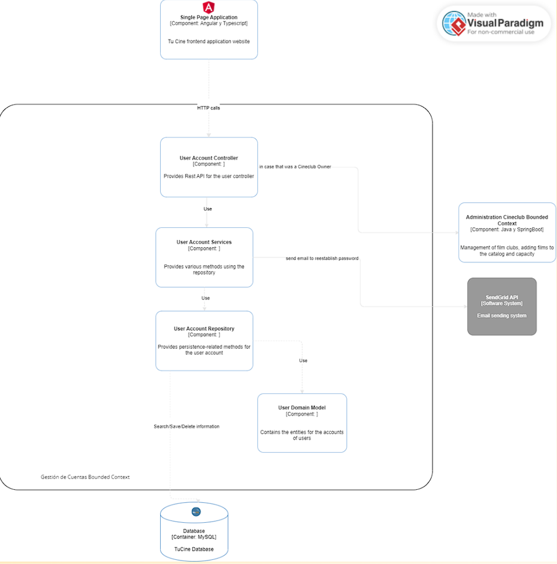
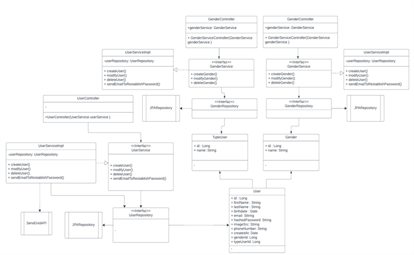
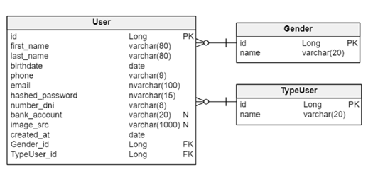
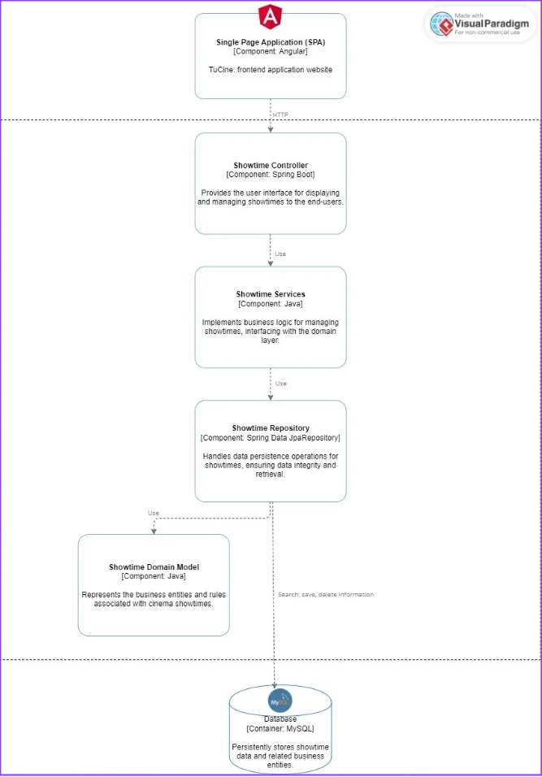
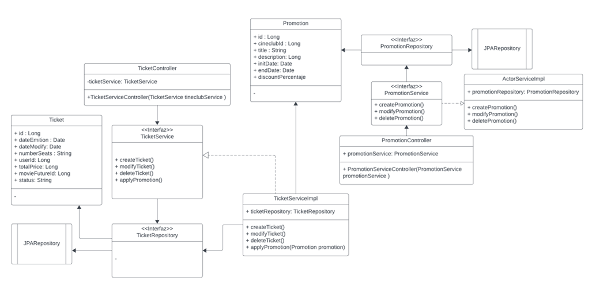
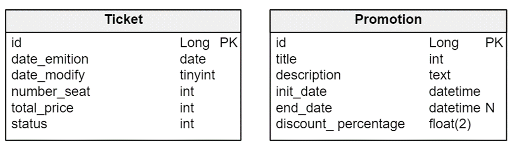

# 5.1 Bounded Context: Account Managment Bounded Context

## 5.1.1 Domain Layer

El contexto de "Account Management" se centra en la gestión de cuentas de usuarios, a bordando aspectos como la autenticación, la gestión de perfiles y la seguridad de la información asociada a las cuentas. Este contexto es crucial en sistemas que requieren la identificación y autorización de usuarios para acceder a funcionalidades específicas.

### Aggregate

El agregado principal en el contexto de "Account Management" podría ser la entidad User, que representa la información y el comportamiento asociado a un usuario dentro del sistema. Esta entidad encapsula los datos relacionados con un usuario y las operaciones que se pueden realizar sobre él.

### Entity

User: Representa a un usuario del sistema, con atributos como Id, firstname, lastname, birthdate, phone, email, hashed_password, numberDNI, bank_account, image_src, created_at, Gender_id, TypeUser_id.

### Value Objects

Gender: Representa el género de un usuario, con atributos como id y name.

TypeUser: Representa el tipo de usuario, con atributos como id y name.

### Domain Services

AuthenticationService: Gestiona la autenticación de usuarios, incluyendo la verificación de contraseñas y la generación de tokens de sesión.

ProfileService: Proporciona funcionalidades relacionadas con la gestión de perfiles de usuario, como la actualización de información personal y la configuración de preferencias.

SecurityService: Se encarga de garantizar la seguridad de la información asociada a las cuentas de usuario, implementando medidas como el hashing de contraseñas y la gestión de permisos.

### Repositories

UserRepository: Abstrae el acceso a datos relacionados con los usuarios, permitiendo operaciones como la creación, lectura, actualización y eliminación de registros de usuarios en la base de datos.

GenderRepository: Gestiona la persistencia de información relacionada con los géneros de los usuarios.

TypeUserRepository: Permite acceder y manipular información sobre los tipos de usuario en el sistema.

## 5.1.2 Interface Layer

En la Interface Layer, el UserController actúa como un punto de entrada para las solicitudes relacionadas con la gestión de usuarios, interactuando con el Domain Layer para ejecutar las operaciones correspondientes y devolver las respuestas adecuadas a los clientes. Este controlador facilita la interacción entre los usuarios y el sistema, proporcionando una interfaz amigable y segura para la gestión de cuentas de usuario.

Controllers
UserController: Controlador encargado de gestionar la información de los usuarios, maneja las solicitudes relacionadas con la creación, recuperación, actualización y eliminación de usuarios en el sistema. Proporciona endpoints para interactuar con las funcionalidades de gestión de cuentas de usuario a través de la interfaz de usuario.

El UserController puede tener métodos como:

CreateUser: Maneja las solicitudes de creación de nuevos usuarios en el sistema.

GetUser: Recupera la información de un usuario específico según su identificador.

UpdateUser: Gestiona las solicitudes de actualización de la información de un usuario existente.

DeleteUser: Maneja las solicitudes de eliminación de un usuario de la base de datos

## 5.1.3 Application Layer

El Application Layer se encarga de orquestar las operaciones de alto nivel relacionadas con la gestión de usuarios, utilizando los servicios de dominio proporcionados por el Domain Layer para realizar las operaciones necesarias de manera eficiente y coherente. Esto ayuda a mantener una separación clara de responsabilidades entre las diferentes capas del sistema y facilita la implementación de cambios y mejoras en el futuro.

### Services

UserManagementService: Este servicio encapsula la lógica de aplicación relacionada con la gestión de usuarios. Actúa como una capa intermedia entre los controladores de la interfaz de usuario y el Domain Layer, coordinando las operaciones necesarias para satisfacer las solicitudes del UserController.

El UserManagementService puede ofrecer métodos como:

createUser: Coordina la creación de un nuevo usuario, validando los datos proporcionados y utilizando el UserRepository para persistir la información en la base de datos.

getUserById: Recupera la información de un usuario específico utilizando el UserRepository y la devuelve al controlador de la interfaz de usuario correspondiente.

updateUser: Gestiona la actualización de la información de un usuario existente, asegurando la coherencia de los datos y utilizando el UserRepository para actualizar la información en la base de datos.

deleteUser: Coordina la eliminación de un usuario específico utilizando el UserRepository.

## 5.1.4 Infraestructure Layer

El Infrastructure Layer se encarga de la implementación concreta de los componentes necesarios para interactuar con el entorno externo al sistema, como la base de datos y otros servicios externos. Proporciona una capa de abstracción entre el Application Layer y los detalles específicos de implementación, lo que facilita la gestión de dependencias y la escalabilidad del sistema. Además, permite realizar cambios en la infraestructura subyacente sin afectar a la lógica de negocio del sistema.

### Repositories Implementations

UserRepositoryImpl: Implementación concreta del UserRepository que interactúa directamente con el sistema de almacenamiento de datos subyacente, como una base de datos relacional o no relacional. Proporciona métodos para ejecutar consultas y operaciones CRUD (Crear, Leer, Actualizar, Eliminar) relacionadas con los usuarios.

### Data Source Configuration

Configuración de la conexión a la base de datos: Este componente se encarga de establecer la conexión con la base de datos utilizada por el sistema, configurando parámetros como la URL de conexión, credenciales de autenticación y configuraciones de conexión específicas del proveedor de base de datos.

### External Services Integration

Integraciones externas: En esta capa también se pueden incluir componentes para integrar servicios externos necesarios para la gestión de usuarios, como servicios de autenticación externos o servicios de almacenamiento de archivos para las imágenes de perfil de los usuarios.

## 5.1.6 Bounded Context Software Architecture Component Level Diagrams

## 5.1.7 Bounded Context Software Architecture Layer Class Diagrams

### 5.1.7.1 Bounded Context Domain Layer Class Diagrams

### 5.1.7.2 Bounded Context Database Design Diagram

# 5.2 Bounded Context: Cineclub Administration Bounded Context

El bounded context de administracion de cineclub es el encargado de dirigir el
manejo del cineclub. Este bounded context será principalmente usado por el propietario
de cineclub, el cual decidirá que películas agregar o quitar de su cartelera.

## 5.2.1 Domain Layer

Las clases pertenecientes al dominio del bounded context de cineclub administration
serán las siguientes:
 

- Film: Representa una película, la cual puede ser agregada o quitada de cartelera del cineclub
- Cineclub: Representa el cineclub que maneja un propietario
- CineclubType: Representa el tipo de cineclub existente , existen un total de 4 tipos de cineclubs
- ContentRating: Representa el tipo de contenido al cual es dirigido una película. Ej: +18 , +14 , etc
- Award: Representa un premio, que puede haber ganado o no una películas
- Actor: Representa un actor, que puede tener una o varias participaciones en diversas películas
- Category: Representa una categoría perteneciente a una película. Ej: Ciencia Ficción, Terror, etc

## 5.2.2 Interface Layer

Las clases pertenecientes a la capa de interfaz del bounded context de cineclub administration
serán las siguientes:
 

- FilmController: Controlador para los procesos relacionados con el manejo de películas
- CineclubController: Controlador para los procesos relacionados con el manejo de cineclubes o un cineclub
- CineclubTypeController: Controlador para los procesos relacionados con el manejo de los tipos de cineclubes existentes.
- ContentRatingController: Controlador para los procesos relacionados con el manejo del contenido clasificado de las películas.
- AwardController: Controlador para los premios de películas
- ActorController: Controlador para los actores que pueden estar presentes en una o varias películas
- CategoryController: Controlador para los procesos relacionados a las categorías existentes para todas las películas

## 5.2.3 Application Layer

La capa de aplicación es la encargada de orquestar las operaciones de alto nivel relacionadas con la
gestión de cineclubes existentes, utilizando servicios que están conectados a la capa de base de datos
para realizar las operaciones necesarias de manera eficiente y coherente.

Services:

- FilmService: Este servicio se encarga de interactuar con la base de datos relacionada con las películas, dentro de sus
  métodos u operaciones que puede realizar tenemos las siguientes:
  - createNewFilm: Creación de una nueva película para un cineclub
  - searchFilmInExteriorAPI: Búsqueda de una película a través de la API externa de The Movie Database
  - searchExistingFilm: Busqueda de una película existente
     
     
- CineclubService: Este servicio se encarga de interactuar con la base de datos relacionada con los cineclubes individuales
  pertenecientes a cada propietario, dentro de algunos de sus métodos u operaciones que puede realizar tenemos las siguientes:
  - createCineclub: Creación de un nuevo cineclub
  - modifyCineclub: Modificación de la información de un cineclub
  - deleteCineclub: Eliminación de un cineclub de un propietario
     
     
- CategoryService: Servicio encargado de interactuar con la base de datos relacionada con las categorías individuales de cada películas
  , dentro de algunos de sus métodos u operaciones que puede realizar tenemos las siguientes: - createCategory: Creación de una nueva categoría para las película - modifyCategory: Modificación de una categoría existente - deleteCategory: Eliminación de una categoría

## 5.2.4 Infraestructure Layer

Se tienen clases para el consumo de APIs externas de nuestra aplicación: TMDBAPI. Especificamente en este bounded context
se hace uso de una clase para el consumo de la API de The Movie Database, con el fin de extraer información de
películas existentes. De manera que los propietarios de cineclub solo tengan que buscar a través de esta API
películas que deseen añadir a su cartelera, en lugar de crear manualmente una película y luego añadir. Esto
se hace con el fin de aligerar y hacer menos tedioso el proceso de búsqueda y añadidura de películas para
los cineclubes.

## 5.2.6 Bounded Context Software Architecture Component Level Diagrams

## 5.2.7 Bounded Context Software Architecture Layer Class Diagrams

### 5.2.7.1 Bounded Context Domain Layer Class Diagrams

### 5.2.7.2 Bounded Context Database Design Diagram

# 5.3 Bounded Context: Showtime Managment Bounded Context

El Bounded Context de Showtime encapsula la funcionalidad relacionada con la gestión de las proyecciones de películas en un cine.

## 5.3.1 Domain Layer

### Entities

- **Showtime**: Representa una proyección específica de una película en un horario determinado.

### Value Objects

- **Schedule**: Puede ser un objeto de valor que indica la hora de inicio y fin de una función. Es inmutable y no tiene identidad propia.

### Aggregates

- **Showtime Aggregate**: Este sería el agregado raíz incluida la entidad Showtime y asociado al cineclub. Garantiza que no se superpongan las proyecciones en una sola sala.

### Domain Services

- **Scheduling Service**: Gestiona la logística de programación de proyecciones asegurando que no haya superposiciones horarias en la única sala del cine.

### Repositories

- **Showtime Repository**: Gestiona la recuperación y el almacenamiento de datos de proyección fundamentales para acceder a la información de proyección por cine y gestionar la programación.

## 5.3.2 Interface Layer

### Controllers

- **ShowtimeController**: Gestiona las solicitudes para las proyecciones de películas.

### DTOs

- **ShowtimeDTO**: Contiene los datos de una proyección como la película, la hora de inicio y fin y la sala. Se utiliza para transportar datos de las proyecciones entre el cliente y el servidor.

## 5.3.3 Application Layer

### Command Handlers

- **CreateShowtimeCommandHandler**: Maneja la lógica de aplicación para crear un nuevo showtime.

### Event Handlerss

- **ShowtimeScheduledEventHandler**: Se encarga de gestionar las acciones posteriores a la programación exitosa de un showtime (notificaciones o integraciones con otros sistemas).

### Application Services

- **ShowtimeService**: Este servicio de la aplicación proporcionaría métodos de alto nivel para los casos de uso relacionados con los showtimes como `scheduleShowtime()`, `getShowtimeDetails()`, `updateShowtimeDetails()`, y `deleteShowtime()`. Estos métodos se comunicarían con los command handlers y los event handlers apropiados.

## 5.3.4 Infraestructure Layer

- **ShowtimeRepositoryImpl**: Una implementación del ShowtimeRepository que podría utilizar un ORM (Object-Relational Mapping) como Hibernate para mapear las entidades del dominio a registros de una base de datos relacional.

## 5.3.6 Bounded Context Software Architecture Component Level Diagrams

El diagrama de componentes del bounded context de Showtime en una aplicación de cine muestra la estructura y las interacciones entre los componentes que gestionan la visualización y administración de horarios de películas. Consiste en una Aplicación de Página Única (SPA) implementada con Angular y TypeScript, que proporciona la interfaz de usuario. Las peticiones de los usuarios son manejadas por el Controlador de Showtime, que procesa operaciones mediante la API REST. Este controlador utiliza los Servicios de Showtime para ejecutar la lógica de negocio, los cuales a su vez interactúan con el Repositorio de Showtime implementado en JpaRepository para la persistencia de datos. Este repositorio gestiona las entidades definidas en el Modelo de Dominio de Showtime, almacenadas en una Base de Datos MySQL.

## 5.3.7 Bounded Context Software Architecture Layer Class Diagrams

### 5.3.7.1 Bounded Context Domain Layer Class Diagrams

El ShowtimeController es responsable de manejar las peticiones y hace uso del ShowtimeService para ejecutar operaciones relacionadas con los showtimes. Este servicio es una interfaz implementada por ShowtimeServiceImpl, que a su vez interactúa con el ShowtimeRepository para operaciones de persistencia de datos. El repositorio es una extensión de JPARepository, lo que facilita las operaciones CRUD sobre la entidad Showtime, que contiene datos esenciales como el identificador de la función, fecha, ID de película, cantidad de asientos disponibles, y otros atributos relevantes. Este diseño desacopla la lógica de negocio de la interfaz de usuario y la gestión de datos, permitiendo un mantenimiento y escalabilidad eficientes.

### 5.3.7.2 Bounded Context Database Design Diagram

La tabla showtimes en la base de datos está diseñada para almacenar información sobre las funciones de películas.

# 5.4 Bounded Context: Booking Bounded Context

El Booking Bounded Context es responsable de la gestión de la compra de boletos en la aplicación TuCine. Este contexto permite a los usuarios comprar boletos para las funciones de películas, asegurando que puedan asistir a las proyecciones seleccionadas.

## 5.4.1 Domain Layer

En la capa de dominio, las siguientes entidades juegan un papel crítico en el manejo de la lógica de negocio asociada con la reserva de entradas:

- Ticket: Representa el boleto comprado por un usuario. Incluye información sobre la fecha de emisión, la fecha de modificación, el número de asientos, el ID del usuario, el precio total, el ID de la futura película y el estado del boleto.
- Promotion: Define una promoción aplicable a la compra de boletos, con detalles como el título, la descripción, la fecha de inicio y finalización, y el porcentaje de descuento.

## 5.4.2 Interface Layer

La capa de interfaz contiene clases que interactúan directamente con los usuarios finales y otros servicios. En este contexto, incluye:

- TicketController: Maneja las solicitudes de los usuarios relacionadas con la creación, modificación y compra de boletos. Se comunica con - TicketService para realizar estas operaciones.
- PromotionController: Gestiona las promociones disponibles para los usuarios al comprar boletos. Interactúa con PromotionService para crear, modificar y eliminar promociones.
- TicketService: Define las operaciones que pueden realizarse con los boletos, como crear, modificar y aplicar promociones.
- PromotionService: Encapsula la lógica de negocio para la gestión de promociones que se aplican a la compra de boletos.

## 5.4.3 Application Layer

La capa de aplicación del contexto limitado de reservas actúa como mediador entre la interfaz de usuario y la lógica de negocios encapsulada en la capa de dominio. Su función principal es coordinar las acciones de los usuarios con los servicios y repositorios necesarios para la ejecución efectiva de las funcionalidades de reserva de boletos.

Services:

- TicketService: Este servicio es responsable de las transacciones de alto nivel relacionadas con la emisión, modificación y gestión de boletos de cine. Algunas de sus operaciones fundamentales incluyen: - issueTicket: Emite un nuevo boleto para el usuario. - modifyTicket: Permite la modificación de un boleto existente. - cancelTicket: Maneja la cancelación de boletos emitidos. - applyPromotionToTicket: Aplica promociones disponibles al precio de los boletos.

Estos servicios interactúan con el repositorio de boletos para garantizar que todas las transacciones se reflejen correctamente en la base de datos.

## 5.4.4 Infraestructure Layer

La capa de infraestructura proporciona las herramientas y servicios técnicos necesarios para apoyar las operaciones de la capa de aplicación y del dominio. En el contexto de la reserva de boletos, esto puede incluir:

- TicketRepository: Es el punto de acceso para las operaciones de almacenamiento y recuperación de datos relacionados con los boletos, como guardar un nuevo boleto, actualizar uno existente o eliminar un boleto cancelado de la base de datos.
- PromotionRepository: Gestiona las operaciones de datos para las promociones, incluyendo su creación, actualización y eliminación en la base de datos.

Además, esta capa maneja la integración con cualquier API externa o microservicio necesario para las operaciones de reserva, así como la configuración de la infraestructura necesaria para ejecutar los servicios y repositorios de manera eficiente y segura. Esto podría incluir, por ejemplo, la implementación de colas de mensajes para el manejo de transacciones de alto volumen o la implementación de sistemas de caché para mejorar el rendimiento.

## 5.4.6 Bounded Context Software Architecture Component Level Diagrams

El diagrama de componentes del bounded context de reservas en TuCine detalla la arquitectura de la aplicación de ticketing. Implementado como una SPA en Angular, el sistema gestiona peticiones de usuarios a través del Booking Controller, usando Spring Boot para procesar operaciones como compras y promociones. La lógica de negocio se maneja en los Booking Services en Java, que interactúan con repositorios JpaRepository para persistir datos en una base de datos MySQL, asegurando la integridad y disponibilidad de la información de boletos y promociones.

## 5.4.7 Bounded Context Software Architecture Layer Class Diagrams

### 5.4.7.1 Bounded Context Domain Layer Class Diagrams

El TicketController es responsable de manejar las solicitudes de los usuarios relacionadas con la creación, modificación y compra de boletos. Se comunica con el TicketService para realizar estas operaciones. El TicketService, a su vez, interactúa con el TicketRepository para acceder y manipular los datos de los boletos en la base de datos. La entidad Ticket representa un boleto comprado por un usuario, con atributos como el ID del boleto, la fecha de emisión, la fecha de modificación, el número de asientos, el ID del usuario, el precio total, el ID de la futura película y el estado del boleto.

### 5.4.7.2 Bounded Context Database Design Diagram

La tabla tickets en la base de datos está diseñada para almacenar información sobre los boletos comprados por los usuarios. Incluye detalles como el ID del boleto, la fecha de emisión, la fecha de modificación, el número de asientos, el ID del usuario, el precio total, el ID de la futura película y el estado del boleto.

# 5.5 Bounded Context: Comments Bounded Context
El Bounded Context de Comments encapsula la funcionalidad relacionada con los comentarios de los cinefilos hacia las reseñas de las peliculas y cines establecidos en la aplicacion.

## 5.5.1 Domain Layer
Las clases pertenecientes al dominio del bounded context de Comentarios serán las siguientes:

Comment: Representa un comentario de un usuario
MovieComments: Representa el comentario de una pelicula
CineclubComments: Representa comentario de un Cineclub

## 5.5.2 Interface Layer
MovieCommentController: Controlador para los comentarios relacionados a una pelicula
CineclubCommentController: Controlador para los comentarios relacionados a un cineclub
## 5.5.3 Application Layer
La capa de aplicación es la encargada de orquestar las operaciones de alto nivel relacionadas con los comentarios respecto a los cineclubs y peliculas, utilizando servicios que están conectados a la capa de base de datos para realizar las operaciones necesarias de manera eficiente y coherente.

Services:

MovieCommentService: Este servicio se encarga de interactuar con la base de datos relacionada con los comentarios de las peliculas, dentro de sus métodos u operaciones que puede realizar tenemos las siguientes:
createComment: Creación de un nuevo comentario a una pelicula
modifyComment: Modificacion de un  comentario existente de una pelicula
deleteComment: Eliminacion de un comentario existente
replieComment: respuesta a un comentarion de pelicula

CineclubCommentService: Este servicio se encarga de interactuar con la base de datos relacionada con los comentarios de los Cineclubs, dentro de sus métodos u operaciones que puede realizar tenemos las siguientes:
createComment: Creación de un nuevo comentario a un Cineclub
modifyComment: Modificacion de un  comentario existente de un Cineclub
deleteComment: Eliminacion de un comentario existente
replieComment: respuesta a un comentarion de un Cineclub

## 5.5.4 Infraestructure Layer
MovieRepositoryImpl: Una Implementación concreta del MovieRepository que interactúa directamente con el sistema de almacenamiento de datos subyacente, como una base de datos relacional o no relacional. Proporciona métodos para ejecutar consultas y operaciones CRUD (Crear, Leer, Actualizar, Eliminar) relacionadas con los Comentarios de las peliculas.
CineclubRepositoryImpl: Una Implementación concreta del CineclubRepository que interactúa directamente con el sistema de almacenamiento de datos subyacente, como una base de datos relacional o no relacional. Proporciona métodos para ejecutar consultas y operaciones CRUD (Crear, Leer, Actualizar, Eliminar) relacionadas con los Comentarios de los Cineclubs.

## 5.5.6 Bounded Context Software Architecture Component Level Diagrams

## 5.5.7 Bounded Context Software Architecture Layer Class Diagrams

### 5.5.7.1 Bounded Context Domain Layer Class Diagrams

### 5.5.7.2 Bounded Context Database Design Diagram

